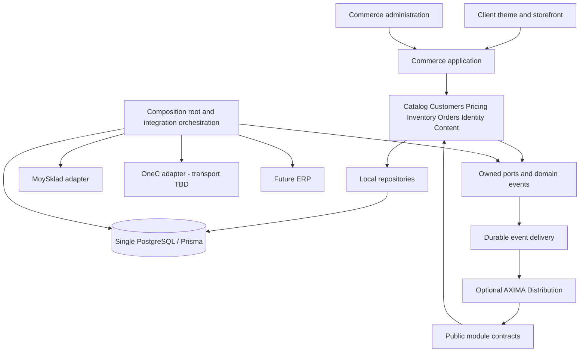
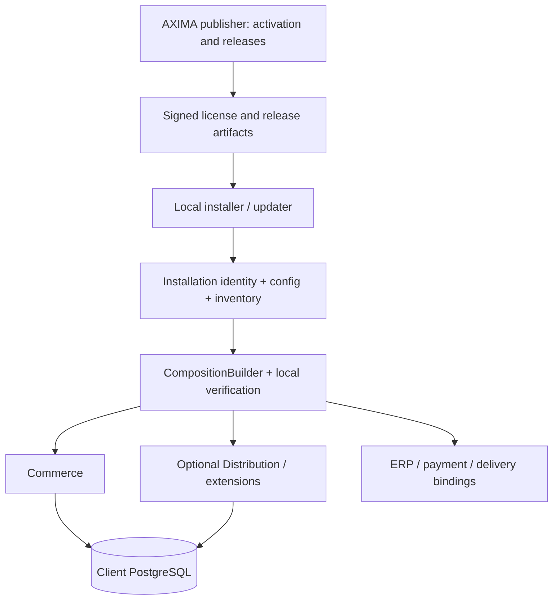

# AXIMA Commerce — архитектура выделения из Hookah Store

Статус: **предложение для согласования; только анализ, не разрешение на миграцию**. Дата: 2026-09-06.

Последующее разрешение пользователя: **Phase 1 — baseline + seams**, без массовых переносов и переделки Prisma. Узкий implementation slice и фактические результаты проверки описаны в [AXIMA_PHASE1_BASELINE.md](./AXIMA_PHASE1_BASELINE.md). Исторические остановки design stage ниже не отменяют это разрешение; Phase 2 и deployment им не разрешены. Integration verification gate пока открыт из-за доступа к локальной тестовой БД.

Дополнение 2026-09-06: исходный анализ концептуально согласован пользователем; начало Phase 1 явно отложено. §17 расширяет решение до self-hosted AXIMA Platform. Новые решения о поставке, лицензиях и rollout пока являются предложением. Явный реестр уточнений §8/11/12/14/15 находится в начале §17; исходный Domain Map сохраняется.

Исследован рабочий checkout `C:/code/Projects/hookah_store`, HEAD `9e07e93523e4f56a7560e357a6579cd009704060`. Документ размещён в исходном проекте, поскольку описывает его разделение. Новый клиентский workspace — `C:/code/Projects/westside`; референсы находятся в его `Reference/`.

**Рекомендация:** выделять AXIMA Commerce через публичные контракты существующих модулей, сохраняя один PostgreSQL/Prisma-контур и работающий Next.js-монолит. Сначала отделить владение данными, политики доступа и ERP-побочные эффекты; перенос каталогов и упаковка платформы идут после этого. Distribution использует публичные операции общих модулей и подписывается на события. Commerce запускается без Distribution и без его фоновых задач. Конкретный транспорт 1С сейчас не проектируется.

## 1. Current Architecture

### 1.1. Что существует в коде

| Слой | Реализация и наблюдение |
|---|---|
| Runtime | Next.js `14.2.35`, React 18, App Router; страницы и Route Handlers в одном приложении (`package.json`, `src/app/`) |
| Данные | PostgreSQL, Prisma 5, singleton `src/lib/db.ts`; 129 моделей в `prisma/schema.prisma` |
| Application logic | Функции `src/lib/`, но значимая часть записей и orchestration остаётся в Route Handlers |
| Идентификация | NextAuth, `src/lib/auth.ts`, роли BUYER/STAFF/ADMIN; действующая сессия содержит `groupId`, а не только исторический tier |
| Каталог | `catalog.ts`, `products.ts`, `mobile-catalog.ts`, `taxonomy.ts`, `warehouses.ts`, `pricing.ts`; локальные данные, кэши и Next cache tags |
| Checkout | `src/app/api/orders/route.ts` → `src/lib/orders/create-order.ts`; город заведения → склады → группа заказов; локальная транзакция, затем PDF/ERP/уведомления |
| Клиентское состояние | Zustand: `cart-store.ts`, `rack-store.ts`, `warehouse-store.ts`; серверная корзина `src/lib/cart/server.ts` |
| Back office | `src/app/staff/`, `src/app/api/staff/`, `src/components/staff/` одновременно обслуживают Commerce administration и Distribution |
| Интеграции | `moysklad/{client,sync,sales-import,orders,images,progress}.ts`, API интеграций, webhook, cron; не изолированы от business/application logic |
| Фоновые вычисления | `src/lib/jobs/queue.ts`, `scripts/analytics-worker.mjs`, cron routes; это не основание вводить микросервисы |
| Presentation | `src/components/layout/`, `src/app/{globals,home,fonts}.css`, `tailwind.config.ts`, CMS и storefront-компоненты |

Дополнительный поток заказа: публичное подтверждение менеджерского черновика в `src/app/api/order-confirmation/[token]/confirm/route.ts`. Он сам создаёт заказ и экспортирует его в МС; это не вызов основного checkout. Значит, выделить только `create-order.ts` недостаточно.

### 1.2. Анализ graph.json и его ограничения

Использован существующий `graphify-out/graph.json`: 3 214 узлов, 7 242 links, 9 hyperedges; `built_at_commit = 84938ee799aea24301ad0819c68ffadca1be3ce2`. В нём 1 290 связей `imports_from`, 1 682 `imports`, 1 540 `calls`, 21 `shares_data_with`. Это узлы файлов **и символов**, а не число файлов или уникальных зависимостей.

Поле `directed: false`: нельзя использовать неориентированную достижимость как доказательство Commerce → Distribution. Для анализа были отобраны `imports_from`, target сопоставлен с `nodes[id].source_file`, затем направление и наличие критических импортов проверены по текущим исходникам. Семантические/INFERRED связи служили подсказками, а не доказательством runtime-зависимости. Граф не перегенерировался.

| Узел графа | Входящих `imports_from` в сохранённом графе | Вывод |
|---|---:|---|
| `src/lib/db.ts` | 224 | Общая точка доступа к данным; нет контроля владельцев записи |
| `src/lib/api/staff-auth.ts` | 108 | Общий guard; название staff не делает его Distribution-domain |
| `src/lib/auth.ts` | 72 | Identity — обязательная общая граница |
| `src/lib/settings.ts` | 36 | Смешаны платформенные, клиентские и интеграционные настройки |
| `src/lib/warehouses.ts` | 24 | Смешаны inventory, geographic scope, Next cookies и ERP config |
| `src/lib/sales/customer-scope.ts` | 23 | Существенная связь общей работы с заказами с Distribution-доступом |
| `src/lib/pricing.ts` | 12 | Уже полезный модуль цен, сохранять алгоритм |

Конкретное расхождение графа: он показывает импорт `moysklad/orders` из `api/orders/route.ts`; сейчас handler вызывает `orders/create-order.ts`, а ERP-импорт находится в этой функции. Новые registration → analytics/customer и цепочки Telegram также проверены по исходникам. Метрики выше относятся к снимку графа, не к HEAD.

Метод: граф → проверка импортов и динамического импорта критических потоков → Prisma-модели и relations → чтение checkout, order confirmation, pricing, customer matching, ERP import/export, guards и presentation. Это статический архитектурный анализ, не полный runtime-аудит. Production-БД, ERP и реальные задания cron не запускались; заполненность Customer, качество backfill и состояние интеграций на production неизвестны.

Документация репозитория использована как контекст, не как новое задание. Например, `AGENTS.md` ещё говорит об отсутствии тестов и tier-pricing, но в текущем `package.json` есть Vitest и integration scripts, а checkout читает group/warehouse pricing. `PRODUCT.md` описывает прежний мобильный редизайн «Истины»; он не задаёт дизайн нового клиента.

## 2. Domain Map

| Область | Владелец | Обоснование |
|---|---|---|
| Витрина, поиск, фильтры, SEO, CMS, блог | Commerce | Покупательский путь и управление содержимым магазина |
| Cart, checkout, кабинет, история, повторный заказ | Commerce | Работают без менеджеров, РОПа и аналитических расчётов |
| Catalog, customers, identity, pricing, inventory, orders | Shared/Core, с отдельным владельцем каждого модуля | Одна бизнес-сущность и один источник истины для обоих продуктов |
| Сегмент покупателя для цены/акции | Customers/Commerce pricing | Не требует RFM/ABC/XYZ; аналитический сегмент — другая проекция |
| Бонусы, referral, «полка» | Опциональные Commerce-модули | Покупательские функции, но не обязательны для любого магазина |
| Менеджерские черновики и assisted sales | Distribution | Публичное подтверждение — extension surface; основной checkout автономен |
| РОП, org, планы, визиты, задачи, рекомендации | Distribution | Внутренние процессы дистрибьютора |
| Закупки, forecasting, аналитические факты | Distribution | Не включать движок аналитики в Commerce shared kernel |
| Факт отгрузки, статус исполнения, возврат | Shared fulfillment contracts | Кабинет должен видеть исполнение без собственного логистического кабинета |
| Сканирование марок, УПД/ЭДО, курьерские операции | Опциональное Distribution fulfillment / compliance | Не обязательная зависимость storefront; сохраняются для «Истины» |
| ERP transport, mapping, sync state, external IDs | Integrations | Данные преобразуются до поступления во внутренние use cases |
| UI primitives, DB runtime, audit, jobs runtime | Infrastructure | Не бизнес-домен; общий пакет не должен превращаться в склад всех helpers |

## 3. Commerce Boundary

Commerce содержит покупательские use cases и композицию общих модулей: browse/search, product details, price quote, stock availability, cart, checkout, account, order history, customer auth, content/SEO, buyer notifications. В нынешнем проекте detail/варианты товара реализованы также компонентами и API, не только отдельной page; нельзя считать отсутствие выделенного URL отсутствием функции.

**Commerce administration обязательно:** каталог, категории/бренды/линейки, цены, наличие, акции, контент, обработка заказов и базовая модерация покупателей. Эти функции сейчас частично расположены в `staff`. Самостоятельному магазину нужен оператор с правами Commerce, но не менеджерская оргструктура Distribution.

Граница API: browser/server components → Commerce application functions → публичные Catalog/Customers/Pricing/Inventory/Orders contracts → локальные repositories. HTTP handlers оставляют validation, session и mapping response; Zod-схемы пока сохраняются в route.ts согласно соглашениям проекта. Не заставлять Server Components ходить HTTP к собственному backend.

Commerce не импортирует `distribution/*`, `lib/sales/*`, `lib/org/*`, аналитический engine, конкретные ERP SDK или Prisma-модели Distribution. Физическое наличие старых nullable relations в общей Prisma-схеме временно допустимо; Commerce queries не выбирают эти relations.

Неуниверсальные особенности текущего магазина — B2B-реквизиты, несколько юрлиц/складов в городе, минимальные условия заказа, бонусы, маркировка — оформляются явными включаемыми policies/capabilities. Во время выделения поведение «Истины» сохраняется. B2C-flow или новые способы оплаты этим анализом не изобретаются.

## 4. Distribution Boundary

Distribution владеет:

- sales workspace, customer/territory assignment, оргструктурой и РОПом;
- «Мой день», планами дня, маршрутами, визитами и потенциальными точками;
- задачами, комментариями и модераторскими очередями с назначением менеджера;
- менеджерскими черновиками заказов, их ценовой политикой и lifecycle;
- sales plans/versions/contributions/approvals, ABC/XYZ/RFM, forecasts, opportunities, procurement;
- аналитическими facts/profiles/snapshots и worker recipes;
- внутренними отгрузками, сканированием, документарным workflow и courier operations;
- уведомлениями менеджеру, эскалацией РОПу, атрибуцией продаж.

Публичная страница подтверждения менеджерского заказа остаётся частью extension, хотя доступна покупателю. В composition «Истина» маршрут сохраняется; в standalone Commerce он не устанавливается, а не падает на отсутствующем `ManagerOrderDraft`.

Distribution может вызывать `Orders.submitAssistedOrder(...)`, `Customers.get(...)`, `Inventory.getAvailability(...)` через public API. Для assisted order нужен явно отдельный контракт с authority и согласованной ценой; нельзя пропускать менеджерские скидки через публичный checkout без проверки полномочий. Нельзя автоматически заменить существующий confirm на checkout: у них разные условия и результаты.

## 5. Shared/Core Boundary

Shared/Core — набор небольших владельцев, а не единый универсальный «core service». Каждый модуль владеет записью в свои агрегаты; другой продукт использует public queries/commands или read projection. Общие Prisma types не должны становиться публичным API всей платформы.

| Сущность пользователя | Фактическая модель | Решение и использование |
|---|---|---|
| Product | `Product` и товарные связи | Одна запись: каталог/checkout и analytics/manager drafts/закупки. Аналитические профили остаются extensions |
| Category | `Category`; `Product.category` — строка | Один справочник, merge aliases сохраняются. Distribution читает также категорию через Product. FK-миграцию не совмещать с первым выделением |
| Brand | `Brand`, `BrandLine`; `Product.brand/line` — строки | Общая таксономия; storefront-поля видимости — presentation metadata, не повод дублировать бренд |
| Customer | Уже есть `Customer` | Канонический коммерческий клиент; регистрация и Distribution используют существующий агрегат. Shadow/read-side миграция ещё требует проверки данных |
| LegalEntity | `BuyerLegalEntity` | Юрлицо покупателя, одна модель; checkout/PDF и manager draft используют её. Реквизиты продавца сейчас на Warehouse, это другая бизнес-роль |
| Location | `BuyerEstablishment`, `City`, `Region` | Торговая/доставочная точка, география и территория — не одна универсальная Location. `SalesVisit`/`PotentialEstablishment` остаются Distribution |
| Order | `Order` | Общий заказ с происхождением и scoped commands; магазин, менеджер и импорт используют одну запись |
| OrderItem | `OrderItem` | Одна строка истории; nullable product, name snapshot и qtyRaw сохраняются для несопоставленных импортных позиций |
| Warehouse | `Warehouse`, `WarehouseProduct` | Склад и доступность товара общие. Cookies, staff scope, юрреквизиты и credentials логически разделить |
| Price | `ProductPrice`, `CustomerGroup` | Владение Pricing. Уникальность product/group/warehouse; fallback chain сохраняется. `CustomerGroupWarehousePriceType` — mapping интеграции |
| Stock | `Stock`, `StockMovement`, availability в `WarehouseProduct` | Владение Inventory; и Commerce, и Distribution вызывают его операции, не создают свои остатки |
| User / Identity | `User`, `AuthNonce` | Человек с логином не равен Customer или ERP-counterparty. Роли/сессии общие; managerId, departmentId, msOwnerName — legacy extension fields |

Подтверждение совместного доступа: `orders/create-order.ts` читает Product/Stock/ProductPrice/BuyerEstablishment/BuyerLegalEntity/Warehouse; `lib/manager-orders.ts` загружает buyerLegalEntity/establishment/warehouse/items; `lib/analytics/products.ts` читает Product; `lib/analytics/customer.ts` создаёт Customer и связывает User/BuyerLegalEntity/BuyerEstablishment/MsCounterparty. Это общие сущности, а не два независимых набора моделей.

У Customer сейчас есть `responsibleManagerId`, `salesDirection`, `categoryPartnerType`, у User — turnover и msSegment. В первом проходе не удалять поля. Целевой Customers public DTO предоставляет профиль и связи; Distribution получает назначение и аналитические атрибуты через собственную проекцию. Будущее выделение 1:1 extension допустимо, но не новая копия Customer.

## 6. Integration Boundary

Интеграционный слой владеет transport/auth, source mapping, validation входа, внешними идентификаторами, checkpoint/retry и диагностикой. Commerce владеет правилами цены, доступности, заказов и публичными статусами. ERP не является online dependency каждого запроса каталога.

Текущее полезное основание: `SourceConnection`, `SourceCursor`, `SyncLog`, `src/lib/jobs/queue.ts`. У `SourceConnection` сейчас обязательный `warehouseId`, provider enum лишь MOYSKLAD/INTERNAL, unique(provider,name). Это foundation аналитического обмена, **не готовый универсальный Integration Layer**. Расширять последовательно после проверки всех consumers; analytics job payload не делать обязательным для Commerce.

`MsSale`, `MsSaleItem`, `MsCounterparty` — legacy source mirror/anti-corruption representation. Они не становятся Commerce DTO. `AnalyticsSalesFact` нормализует суммы и происхождение, но сохраняет `MsSaleDocType`, `counterpartyMsId`, `productMsId` и исторические FK; это Distribution read model, не готовый Commerce Domain.

Прочие интеграции отделены от ERP capabilities: `integrations/dadata.ts`, `mobileid`, `auth/signalum.ts`, messenger transports, mail, CRPT/EDO. Их наличие в продукте задаёт composition; универсальный ERP-adapter не должен включать все внешние сервисы.

## 7. Current Coupling Problems

Номера строк относятся к исследованному checkout и служат ориентирами; точные имена функций устойчивее при последующей разработке.

| Связь, подтверждённая текущим кодом | Проблема | Предлагаемый seam |
|---|---|---|
| `api/auth/register/route.ts:11` → `analytics/customer.ts::ensureCustomerForUser` | Регистрация зависит от файла аналитики и сопоставления с MsCounterparty | Создание/связывание Customer → Customers; ERP matching → integration service, legacy facade сохраняет вызовы |
| `api/auth/register/route.ts:12` → `telegram-notify/registration-alert.ts` → `sales/customer-moderation.ts`, `sales/approve-registration.ts` | Регистрация тянет модераторский процесс Distribution | Registration policy в Commerce; `RegistrationRequested` для опциональной очереди Distribution |
| `api/orders/route.ts:7`, `api/orders/[id]/route.ts:9` → `sales/customer-scope.ts` | Buyer и staff ветки общего API используют Distribution scope | Разделить buyer self-access, Commerce operator permission и Distribution territory policy; сохранить HTTP routes |
| `orders/create-order.ts:21` → `telegram-notify/order-alert.ts` → `supervisor.ts` → `org/departments.ts` | Checkout тянет менеджера и РОПа | `OrderPlaced` → Distribution subscriber; buyer notifications независимы |
| `api/order-confirmation/[token]/*` → `manager-orders.ts` | Публичный URL ошибочно можно принять за core Commerce | Extension-owned routes и assisted-order public command |
| `orders/create-order.ts:9` → `moysklad/orders.ts`; проверки `warehouse.msEnabled/msExportOrders` | ERP выбран внутри checkout, export result содержит msId | Durable export intent через Orders/Integration contracts; binding в composition |
| `api/order-confirmation/[token]/confirm/route.ts:6` → `moysklad/orders.ts` | Второй прямой ERP export; легко пропустить при миграции | Тот же delivery mechanism, отдельная assisted-sales policy |
| `taxonomy.ts:4` → `moysklad/client.ts::BRAND_LINE_SEPARATOR` | Общая таксономия зависит даже от константы ERP-клиента | Локальное представление линейки в Catalog; парсинг pathName в MoySklad mapper |
| `mobile-catalog.ts:3` → `analytics/ms-sales.ts::loadBrandAbcAnalysis/resolveAbcPeriod` (дополнено Phase 1 baseline) | Мобильный каталог использует аналитическую выборку Distribution | Определить локальный Catalog ranking/read contract; пока сохранить поведение и зафиксировать coupling |
| `warehouses.ts::warehouseToMoySkladConfig` рядом с cookies/scope/catalog | Универсальный Warehouse helper протаскивает конфигурацию ERP | Разделить warehouse queries, request context и adapter configuration |
| `moysklad/sync.ts` → db/taxonomy/cache; webhook повторяет orchestration | Adapter одновременно пишет domain и знает Next cache | Normalized ingestion use cases + post-commit cache invalidation |
| `moysklad/sales-import.ts` → `analytics/owner-history.ts`; пишет MsSale, Order, Shipment, User | Импорт Commerce заказов связан с аналитикой и CRM | Разделить чтение источника, нормализацию operational data и Distribution projection handlers |
| `api/courier/orders/[id]/delivered/route.ts:5` → `moysklad/client.ts` | Внутреннее исполнение заказа меняет конкретную ERP | Fulfillment event → integration command при поддержке capability |
| `api/orders/[id]/moysklad/route.ts` | Provider-specific retry/status URL | Оставить compatibility endpoint, делегирующий общему export service |
| `mail/templates.ts` → `analytics/types.ts` (`import type`) | Compile-time связь типов, не runtime-вызов аналитики; общие письма и аналитическая рассылка в одном модуле | Разделить шаблоны регистрации/покупателя и Distribution digest |

Важное различие: `segments/assignments.ts::loadUserSegmentIds` сам по себе не является Distribution-зависимостью — Commerce использует memberships для промо. `segments/ms-reconcile.ts` уже относится к adapter mapping. Нельзя переносить весь `segments/` в Distribution.

### Самые опасные семантические связи

1. **Склад/город/продавец/НДС.** `createOrder` выбирает склады города по наличию и sortOrder, делит корзину в N заказов с общим groupId, использует реквизиты склада. Абстракция «одна корзина = один warehouse = один ERP-account» неверна.
2. **Цена.** `pricing.ts` реализует цепочку group → fallback groups → default, цены в разрезе склада; zero/negative — отсутствие продажной цены, но подарок имеет price=0. `basePrice` не заменяет этот алгоритм. Старый `resolvePrice` из settings не принимать за единственную текущую политику.
3. **Остатки.** `useInternalStock` меняет authority: атомарное списание при checkout либо ERP-managed availability. `orders/stock.ts` при отмене и shipment/return flow должны быть согласованы. Нельзя просто назвать существующее списание «резервом».
4. **Деньги и количество.** ProductPrice/Order используют Float, Stock/checkout qty — Int, импорт имеет qtyRaw, аналитика — Decimal. Conversion adapter не должен незаметно округлять дробный товар до доступного к заказу целого.
5. **Оплата имеет два пути.** `orders/payment-status.ts` агрегирует OrderPayment, `moysklad/sales-import.ts::recomputeMsOrderPayment` — msPayedSum + Shipment.paidSum. Объединение без определения authority создаст двойной учёт или потерю оплаты.
6. **Identity и matching.** MsCounterparty не равен User; User.source может быть MOYSKLAD и не иметь логина. `ensureCustomerForUser` использует linked counterparties и ИНН. Не создавать логин каждому внешнему контрагенту и не сливать компании по ИНН автоматически без проверки неоднозначности.
7. **Исторические документы и merge.** `Order.msId` unique обеспечивает обратный импорт экспортированного заказа без новой записи; `OrderItem.productId` nullable; `Product/Brand/Category.mergedIntoId` сохраняет aliases. Новая нормализация не должна оживлять дубли.
8. **Post-commit delivery.** Сейчас экспорт идёт после DB transaction; удалённый заказ может быть создан, а сохранение msId — не выполнено. Проверка существующего msId не решает crash window и конкурентные retries.

## 8. Target Architecture

**Уточнение после согласования:** описанная здесь бизнес-архитектура становится application plane AXIMA Platform. Лицензирование/installer/update orchestration находятся снаружи domain (§17). Workspace packages — средство разработки AXIMA; клиентская поставка — подписанные artifacts (§17.19), а не доступ к registry исходных пакетов.



Это схема ответственностей: adapters реализуют ports, composition передаёт реализации. Domain не импортирует runtime или adapter factory. Dependency injection — обычные параметры функций/фабрики, без обязательного DI-framework и классов Services.

Разрешённые зависимости:

- Theme → Commerce view models/actions; никакой БД, ERP, расчёта окончательной цены.
- Commerce application → public API общих модулей; domain → собственные types/policies/ports.
- Distribution → public core contracts; core → **не** Distribution.
- Infrastructure/adapters → реализуемые ими contracts; wiring только в composition.
- Общая DB transaction проходит через unit-of-work при checkout. Нельзя заменить атомарное списание сетевыми вызовами между модулями.

На первом шаге физически остаётся `src/app` с текущими URL и wrappers в `src/lib`. Позже reusable modules публикуются одной согласованной версией workspace packages; «Истина» и новый магазин используют её с разными composition/theme/config. Не копировать `src/lib` в westside как новую независимую кодовую базу.

Развёртывания разных клиентов могут быть отдельными инсталляциями одного кода. Это **не** предложение делить БД Commerce/Distribution и **не** утверждение, что нынешний singleton AppSettings поддерживает SaaS multi-tenancy. Внутри текущей инсталляции одна БД; multi-tenant schema/tenantId/RLS — отдельное будущее решение. Не подключать новый магазин к production-данным «Истины» по умолчанию.

Проверяемая автономность: standalone composition не регистрирует Distribution routes/subscribers/workers, не нуждается в Department/SalesPlan/MsSale данных; buyer регистрация, каталог, cart, checkout и история работают на core fixtures. Наличие пока неиспользуемых Distribution tables в совместимой схеме не означает runtime-зависимость.

### Presentation/theme layer и Impeccable

Визуально изучены оба PNG из `C:/code/Projects/westside/Reference/`: `Снимок экрана 2026-09-06 123957.png` и `Снимок экрана 2026-09-06 124052.png`. Видны фиолетовая широкая шапка, бирюзовый catalog CTA, крупный поиск, светлое поле, трёхколоночные промо-карточки, пагинация и «Показать ещё». Во втором изображении товары не видны: устройство карточки товара, mobile и checkout по нему не выводятся. S2B, контакты и рекламные обещания на снимках — данные референса, не подтверждённый бренд/контент нового клиента.

Impeccable использован в режиме планирования: прочитаны skill, shape и new-work, выполнен context script, проверены существующие Tailwind tokens. Дизайн или его контракт не утверждены; здесь определяется архитектурный brief, не финальный макет.

Предварительный brief: каталог/checkout — Operate, главная/акции — Persuade; задача — быстро найти ассортимент и собрать заказ с понятными ценой и наличием. Компоненты темы получают `ProductCardView`, `CatalogPageView`, `CartView`, `CheckoutView`, а действия используют общий Commerce API. Registry секций главной выбирает только разрешённые компоненты с валидируемыми CMS props. Навигация, layout карточек, логотип, typography, semantic colors, spacing, density и asset URLs принадлежат теме/клиентской конфигурации.

`packages/ui` в будущем содержит доступные primitives (dialog, button, input, pagination), а не брендированную карточку «Истины». Бизнес-логика корзины/промо и серверный пересчёт цены не перемещаются в theme. Изменение layout не меняет order payload. Изображения акций сопровождаются текстовыми условиями; ключевая информация не должна существовать только в bitmap.

При UI-этапе отдельно согласовать аудиторию B2B/B2C, бренд и исходные assets, mobile-поведение, visibility цены до входа и обязательность реквизитов. Проверить empty/loading/error/no-price/out-of-stock, смену города, длинные названия, overflow, keyboard/focus, mobile filters и ошибки checkout. Отсутствующие условия заказа не выдумывать. Дизайн нового клиента не ограничен старым mobile-only PRODUCT.md «Истины».

## 9. ERP Adapter Architecture

### 9.1. Два вида контрактов

Не вводить `CatalogProvider` как обязательный online HTTP-запрос к ERP из витрины. Нужны:

1. **Локальные бизнес-контракты**: CatalogQueries, PricingQueries/Quote, InventoryAvailability/Adjust, CustomersCommands, OrdersCommands. Они работают с нормализованной БД.
2. **Обменные ports**: CatalogSource, InventorySource, PriceSource, CustomerExchange, OrderSink, OrderUpdatesSource. Они принимают/отдают нормализованные DTO; adapter выбирает transport. Pull, push и файлы не навязываются интерфейсом domain.

Composition выбирает capability по connection и scope склада/организации; не глобальный `if provider === 'moysklad'` внутри заказа. Одна ERP connection потенциально обслуживает несколько складов и организаций. Текущий Warehouse-bound SourceConnection сохранить совместимым, множественный scope вводить additive binding только когда это нужно подтверждённой интеграции.

### 9.2. Данные, направление и authority

| Данные | Нормализованное содержимое | Направление и правило |
|---|---|---|
| Товары | identity, SKU, name, units, attributes, category/brand/line refs, media, active/archive | ERP → ingestion → Catalog; CMS description/SEO/media overrides имеют явное локальное владение |
| Категории/бренды | stable ref, name, parent/line relation, archive | ERP → mapping → локальная таксономия; при отсутствии ERP-справочника поддерживается локальное ведение |
| Склады/организации | warehouse ref, seller ref, реквизиты, delivery scope | ERP → сопоставление с локальными ID; правила маршрутизации задаёт Commerce policy |
| Цены | product, warehouse, price list, currency, amount, tax basis, validity | ERP → Price ingestion; локальный mapping price list → customer group; fallback — Pricing |
| Остатки | product, warehouse, on-hand/available/reserved при наличии, observedAt, snapshot/version | ERP → Inventory; authority режим явно выбирается для scope, нельзя смешать external available и local deduction |
| Клиенты/юрлица/точки | customer/legal/location refs, names, tax IDs, contacts, addresses | Локальная регистрация → CustomerExchange при необходимости; ERP → связанный профиль по mapping. Владение полями оговаривается |
| Заказы | internal order/group IDs, buyer/seller/warehouse, items/snapshots, quote, taxes, totals, delivery/payment method | Commerce → ERP после commit. Импорт старых ERP-заказов опционален и отделён от export |
| Статусы/исполнение | external status ref, occurredAt/version, mapped lifecycle, shipment refs | ERP → Orders/Fulfillment; raw status хранится отдельно. Неизвестный статус не переводит заказ в DELIVERED |
| Оплата | document ref, amount/currency, allocation, occurredAt, version/reversal | ERP → payment projection по согласованной authority; не суммировать два представления одного платежа |

При выборе external authority — явно согласовать staleness cutoff и политику «заказ принят локально / подтверждён ERP». Недоступная ERP не превращается в подтверждённый остаток; UI использует нормализованный delivery state. При internal authority списание остаётся локальным и атомарным. Модель резервов, если потребуется, — отдельное изменение бизнес-логики с согласованием, не часть механического extraction.

### 9.3. DTO v1 — предлагаемые transport-independent формы

Ниже проект контрактов, не готовый SDK. Decimal передаётся строкой без потери точности; currency/unit/tax basis обязательны. Внутренние цены Float конвертируются на границе по зафиксированным правилам, без silent schema migration.

```ts
type ExternalRef = {
  connectionId: string;
  entityType: string;
  externalId: string;
};
type Money = { amount: string; currency: string };
type Quantity = { value: string; unitCode: string };
type Change<T> = {
  schemaVersion: 1;
  eventId: string;
  source: ExternalRef;
  sourceVersion?: string;
  occurredAt: string;
  receivedAt: string;
  operation: 'upsert' | 'archive';
  data: T;
};
type ProductDTO = {
  sku: string; name: string; unitCode: string; active: boolean;
  categoryRefs: ExternalRef[]; brandRef?: ExternalRef;
  lineRef?: ExternalRef;
  attributes: Record<string, string | number | boolean>;
  media: Array<{ url: string; alt?: string }>;
};
type PriceDTO = {
  productRef: ExternalRef; warehouseRef: ExternalRef;
  priceListRef: ExternalRef; money: Money;
  taxBasis: 'included' | 'excluded' | 'not_applicable';
  taxRate?: string; validFrom?: string; validTo?: string;
};
type InventoryDTO = {
  productRef: ExternalRef; warehouseRef: ExternalRef;
  available: Quantity; onHand?: Quantity; reserved?: Quantity;
  observedAt: string; snapshotId?: string;
};
type SubmitOrderDTO = {
  schemaVersion: 1; idempotencyKey: string;
  orderId: string; checkoutGroupId?: string; orderVersion: number;
  customerId: string; legalEntityId?: string; locationId?: string;
  sellerId: string; warehouseId: string;
  customerSnapshot: Record<string, string>;
  sellerSnapshot: Record<string, string>;
  lines: Array<{
    lineId: string; productId: string; sku: string; name: string;
    quantity: Quantity; unitPrice: Money; lineTotal: Money;
    taxBasis: 'included' | 'excluded' | 'not_applicable';
    taxRate?: string; taxAmount?: Money; promotionId?: string;
  }>;
  total: Money; paymentMethod: string;
  delivery: { methodCode: string; address?: string };
  comment?: string;
};
type DeliveryResult =
  | { state: 'accepted'; receiptId: string; externalOrder?: ExternalRef }
  | { state: 'rejected'; code: string; message: string }
  | { state: 'unknown'; correlationId: string };
type OrderUpdateDTO = {
  orderRef: ExternalRef; sourceVersion?: string; occurredAt: string;
  lifecycle?: 'processing' | 'confirmed' | 'delivered' | 'cancelled';
  rawStatus: { code: string; label?: string };
};
interface OrderSink {
  submit(scope: { connectionId: string }, order: SubmitOrderDTO): Promise<DeliveryResult>;
}
```

Internal IDs в SubmitOrderDTO резолвит integration mapping; domain не заполняет msId/onecId/meta.href. Точный CustomerSnapshot/Delivery DTO нужно зафиксировать schema до реализации, вместе с address/contact visibility. `accepted` означает приём обменом, не оплату/отгрузку и не обязательно создание документа; отдельный correlation receipt покрывает асинхронную ERP.

Остальные payloads: `TaxonomyDTO {name,parentRef?,active}`, `CustomerDTO {displayName,legalEntities[],locations[],contacts[]}`, где юрлица имеют stable ref/tax IDs, а точки — stable ref/address/legalEntityRefs. `PaymentUpdateDTO` имеет stable payment/allocation ref, orderRef, signed Money, occurredAt и reversalOf. Эти формы не содержат ownerName, RFM и ms tags. Presence/absence поля различать от явного удаления (patch mask либо полный snapshot с обозначенным scope).

`CatalogSource`, `PriceSource`, `InventorySource` публикуют Change batches с opaque checkpoint и признаком полного snapshot; transport может читать страницы, принимать push либо декодировать выгрузку. `CustomerExchange` отдельно объявляет supported operations (lookup/upsert/import); `OrderUpdatesSource` выдаёт нормализованные события. Неподдерживаемая capability возвращает typed Unsupported, а не фиктивный success. Fake/fixture adapter нужен для contract tests; он не называется рабочим OneCAdapter.

### 9.4. Синхронизация и доставка

1. Initial import: connection/scope mapping → taxonomy/products → prices/inventory → customer refs при необходимости. Новое поколение snapshot становится видимым только после успешной валидации его scope.
2. Incremental changes: idempotent ingestion; checkpoint фиксируется вместе с успешным применением batch. Частичная ошибка не продвигает checkpoint через неприменённые записи. Полный snapshot архивирует отсутствующее только после подтверждения полноты; отсутствие в delta ничего не удаляет.
3. Checkout: Order + stock movements/bonuses + Outbox intent в одной существующей DB transaction. ERP HTTP выполняется после commit worker-ом; сам buyer request не должен ждать доступности ERP. Изменение timing/API утверждается и включается флагом после characterization.
4. Один delivery record на order/version/connection/operation; worker lease, bounded exponential backoff, retries только для retryable ошибок, dead-letter/manual retry для rejected или исчерпанных попыток. Ошибка mapping не лечится бесконечными повторами.
5. При timeout после отправки — `unknown`, reconciliation по устойчивому correlation key/внешнему receipt. Если ERP не поддерживает idempotency или поиск по ключу, автоматический повтор создания блокируется до выяснения результата; exactly-once не обещается.
6. Inbound inbox unique(connection,eventId), отдельный dedupe document ref/version; защита от out-of-order updates. Версии источника opaque: сравнивать только по установленной для adapter семантике, не лексикографически. Unknown status → диагностика, не destructive transition.
7. Связать exported order и imported representation через ExternalReference; сохранить `Order.msId` unique на переходе. Повторно импортированный SITE order не экспортировать новым заказом. echo/version tracking отделён от бизнес-события.
8. Применение prices/stock/catalog заканчивается post-commit invalidation существующих tags/caches. Персональный group/warehouse context включается в cache key; theme не кэширует персональные цены публично.
9. Shipment/return/payment updates проходят owned commands с проверкой переходов; импорт не обходит cancellation/stock/bonus invariants. Distribution analytics subscribes отдельно; сбой профилей не откатывает Commerce order.
10. Диагностика: connection, entity, internal/external ID, correlation, checkpoint, source lag, attempts, normalized error; secrets и полные PII payloads в public API/logs не попадают.

Proposed `IntegrationOutbox`/`IntegrationInbox` — технические журналы доставки в той же БД, не копии Order/Customer. Проверить возможность выделить общий executor из jobs/queue, но не связывать delivery с ModelVersion/CalculationRun аналитики. Старые cron и новый worker не должны одновременно владеть одним sync scope.

### 9.5. MoySkladAdapter и OneCAdapter

MoySkladAdapter вначале оборачивает рабочие mapper/client/export функции; сохраняет копейки↔рубли, multi-store mapping, product links, ручные category/brand merges и legacy статусы. Затем operational ingestion отделяется от sales analytics. Нельзя просто переименовать всю папку и объявить проблему решённой.

`src/lib/onec/client.ts` — неиспользуемая в order flow заготовка Axios, предполагающая `/orders` и `/counterparties/sync`. Это **не подтверждённый протокол клиента** и не основа спецификации. На первом этапе OneCAdapter — capability contract, DTO fixtures и список неизвестных. Ни endpoint, ни CommerceML/OData/REST, ни authentication method не выбираются.

До реализации запросить у 1С-команды: конфигурацию/версию и доработки; доступные механизмы обмена; источник запуска и расписание; stable identifiers и revisions; организации/склады/единицы и характеристики; типы цен/НДС/валюты; available/reserved семантику; контрагент/договор/юрлицо/точку; order/status/payment/cancellation lifecycle; idempotency/correlation, удаления и full/delta формат; sandbox и обезличенные примеры; объёмы/ограничения/доступ. Не требовать конкретную технологию как предварительное условие.

## 10. Database Model Impact

**На этом этапе schema и данные не изменяются.** Target ownership не равен немедленному ALTER TABLE.

| Группа моделей | Будущий владелец | Что делать |
|---|---|---|
| User, AuthNonce | Identity | Сохранить IDs/credentials/session; постепенно ограничить projection и вынести Distribution attributes при реальной необходимости |
| Customer, BuyerLegalEntity, BuyerEstablishment, BuyerEstablishmentLegalEntity | Customers | Сохранить текущие связи; проверить backfill/orphans/ambiguous INN и ownership до переключения read-side |
| City, Region, Warehouse, UserWarehouse, UserRegion | Geography/Inventory/Access | Одна география; access grants не требуют CRM. Seller requisites остаются на Warehouse до отдельного решения |
| Product, Category, Brand, BrandLine, BrandMergeProduct, ProductVariantLink, FlavorTag, StrengthLevel, ProductFlavor, Label, ProductLabel | Catalog + catalog extensions | Не дублировать и не ломать string relations/slug/merge. Отраслевые атрибуты исключать из обязательного generic DTO, не удалять из legacy schema |
| ProductPrice, CustomerGroup | Pricing | Сохранить ключ product/group/warehouse и fallback; Decimal migration — отдельная проверяемая фаза |
| WarehouseProduct, Stock, StockMovement | Inventory | Различать ассортиментную доступность и quantity; authority не выводить из имени provider |
| Order, OrderItem, OrderPayment | Orders | Одна история; nullable imported links, groupId, price/name snapshots, source и legacy ERP fields сохраняются |
| Shipment, ShipmentItem, Return, ReturnItem | Fulfillment | Существующие документы общие; workflow/scanning — Distribution extension. Не создавать CommerceShipment-копию |
| Cart, CartLine, RackItem | Commerce cart / replenishment | Полка опциональна, cart обязателен; ownership проверяется по buyer |
| Promotion, PromotionWarehouse, PromotionSegment, Segment, UserSegment | Promotions/Customers | Promo eligibility отдельно от аналитической сегментации; msPartnerType — external mapping |
| BonusTransaction, BonusRule, BonusProduct, BonusRedemption, BonusWish, ReferralReward | Commerce loyalty extension | Ledger и reward idempotency сохраняются |
| PageBlock, HomeCategory, BlogPost, SitePromo | Content | Связи с каталогом сохраняются; client rendering принадлежит theme |
| AppSettings | Configuration facade | Дать типизированные views Commerce/Distribution/Theme/Integrations поверх прежнего singleton; не размножать singleton на каждый модуль |
| MsCounterparty, MsSale, MsSaleItem, MsTagAlias, SyncLog | Integration legacy mirror | Не удалять: активные Distribution consumers/FK. Выход к core только через normalized mapping |
| SourceConnection, SourceCursor | Integration runtime | Переиспользовать с additive evolution; проверить warehouse binding и enum before ONEC |
| AnalyticsSalesFact/Item и все analytical profiles/plans/forecasts | Distribution | Не переносить в generic shared; существующие Decimal facts полезны только как пример нормализации |
| Department, OrgLevel, OrgPlan, SalesHierarchy, SalesTask и связи, SalesWorkDay, SalesVisit, PotentialEstablishment, ManagerOrderDraft и связи | Distribution | Сохранять модель и данные; выключать runtime-модуль, не чистить таблицы |
| OrderAlert, StaffTelegramLink, CounterpartyOwnerHistory, MsCounterpartyComment | Distribution | Buyer notifications не требуют этих таблиц |
| Mark | Compliance/fulfillment extension | Не часть обязательного checkout generic магазина |
| Notification, PageView, AuditLog, ErrorLog | Notifications/telemetry infrastructure | Разделить producers и templates по модулю, сохранить единые журналы |
| CustomFieldDef, DeliveryMethod | Customer metadata / fulfillment configuration | Usage-specific фасады; не превращать в универсальный entity engine |

Предлагаемые additive структуры, только после approval:

- **ExternalReference**: unique(connectionId, entityType, externalId) → internalEntityType/internalId + optional scope и sourceVersion. Несколько внешних aliases могут указывать на один local ID; не делать internalId globally unique. Полиморфная ссылка требует controlled writer и orphan checks. Legacy msId/onecId продолжают заполняться только для соответствующего provider до отключения старых readers.
- **IntegrationOutbox/Inbox**: минимальные delivery envelopes и уникальные idempotency keys, не полный второй order store.
- **Scope binding/secret reference** при расширении SourceConnection: credentials server-only вне Warehouse DTO; не писать новые токены в свободный metadata JSON. Миграция существующих секретов — отдельная операционная процедура.
- **Customer→Order связь** может быть добавлена nullable после backfill, если нужна заказам организации с несколькими User. Не менять текущие buyer ownership checks на customerId без отдельной модели членства и прав.
- **SellerOrganization** имеет смысл, если несколько складов принадлежат одному продавцу, но это не обязательная новая таблица первого extraction. Сначала DTO/projection текущих Warehouse requisites, потом проверка бизнес-кардинальности.

Expand → backfill batches с checkpoint → shadow comparison → switch reads/writes одного владельца → contract. Запрещены одновременное переименование таблиц, перенос файлов и изменение monetary/stock semantics в одном release. Старый binary должен читать расширенную схему; down migration после появления новых заказов не является безопасным rollback.

## 11. Migration Strategy

**Дополнение к порядку:** до implementation согласовать platform contracts и критерии первого deployment (§17.24). Это не требует сначала строить License/Update Servers. Новые коммерческие module IDs не заменяют владельцев сущностей из §5 и не дают installer права изменять business data.

Использовать strangler migration внутри монолита: поставить contracts/facades вокруг работающего кода; менять одну зависимость за PR. Публичные module entry points сначала могут делегировать legacy functions. Но core facade, который продолжает транзитивно импортировать Distribution, — временный seam, не достигнутая автономность.

Для каждого изменения фиксировать: владельца таблиц/полей, команды и readers, совместимые endpoints, baseline поведения, feature flag, критерии сравнения, rollback. Не останавливать разработку Hookah Store: новые бизнес-изменения идут через обозначенного владельца; migrated и legacy callers используют одну реализацию, без двух ручных копий.

При переносе файла старый import path временно re-export-ит новый public entry point. Не создавать cycle «новый facade → legacy → новый facade». Guardrails сначала с ограниченным allowlist legacy edges, затем новые нарушения запрещены. Проверять import graph, API composition и отсутствие runtime-обращений к Distribution отдельно: lint запретов на пути недостаточен для raw SQL и Prisma relations.

Не выполнять shadow writes во внешнюю ERP. Для сравнений допускается read-only normalization/quote/result comparison. Включение нового exporter или worker одновременно выключает прежнего владельца того же scope.

## 12. Migration Phases

| Фаза | Конкретный результат | Gate перед следующей фазой | Откат |
|---|---|---|---|
| 0 — согласование | Исходная концепция согласована; дополнение §17: manifests, composition, offline licensing, delivery baseline | Отдельно подтверждены новые решения §17.24 и разрешён implementation; до этого Phase 1 не начинается | Только документация |
| 1 — baseline и seams | Characterization checkout/confirm/cancel/pricing/scope; public contracts без переносов; актуальная карта зависимостей | Legacy tests и новые meaningful boundary scenarios проходят; API snapshots совпадают | Удалить wrappers/вернуть calls, БД прежняя |
| 2 — core access/customers | Buyer/operator guards отдельно от sales scope; Customer creation отдельно от analytics matching; shared taxonomy constants | BUYER не получает staff visibility; standalone регистрация не требует MsCounterparty/Department | Composition выбирает старую реализацию, IDs и payloads прежние |
| 3 — export boundary | MoySklad adapter обёрнут normalized order contract; mapping, durable intent, обработка unknown result; assisted flow подключён отдельно | Нет дублей при retries/crash; checked rollback старого exporter; совпадают warehouse/price/tax payloads | Stop/drain worker по scope, reconciliation pending/unknown, затем один старый exporter |
| 4 — ingestion boundary | Catalog/prices/stock/customer/orders operational ingestion отдельно от analytics; connection mapping расширен | Shadow fixtures/reconciliation совпадают; deletions/aliases/cursors корректны; старый cron отключён для switched scope | Один прежний sync owner, сохранённые cursors/legacy fields, без повторных экспортов |
| 5 — optional Distribution | Org/sales/analytics/logistics registrations через validated CompositionBuilder; Next route isolation по §17.17 | Licensed/installed/enabled проверены локально; Commerce-only build/runtime без Distribution data/code; combined regression проходит | Предыдущие validated config и signed artifact восстанавливают registration plan |
| 6 — reusable platform и theme | Единые версии modules; декларативные profiles, client theme/view contracts; signed release комплект и offline installation grant | Две compositions выполняют business flows; локальный verifier и restart без AXIMA network; проверен выпуск artifact без нелицензированных modules | Предыдущие config/theme/artifact, если schema совместима |
| 7 — подтверждённая 1С | После discovery — реальный OneCAdapter, contract fixtures и тестовый обмен | Принятый протокол/authority, sandbox, idempotency/status/payment reconciliation, заказ туда-обратно | Отключить connection; сохранять локальные заказы и pending intents для разбирательства |
| 7a — Westside production readiness | Assisted install из signed bundle: preflight, activation import, secrets, isolated DB, migrations, bootstrap, health и recovery kit | Обязательный checklist §17.24 закрыт; версия и права на неё проверяются offline; восстановление протестировано | До трафика — предыдущая среда; после записей — только совместимый rollback либо согласованное восстановление |
| 8 — cleanup по факту | Удаление только доказанно неиспользуемых facades/fields; упаковка apps при пользе | Ноль readers старого контракта, согласованный срок compatibility и backup/restore validation | Restore-tested план; destructive schema cleanup отдельным release |

Фазы могут разрабатываться небольшими slices: сначала каталог read-side, затем цена/остатки, затем один checkout path. Полная готовность нового магазина к ERP-orders невозможна до сведений о 1С; это не мешает core extraction и UI fixtures. Не выдавать fixture exchange за готовый коммерческий запуск.

### Проверки во время реализации

- Pricing: group fallback/cycles/default, city vs actual warehouse, no-price и zero-price gifts, snapshot totals.
- Checkout: multi-warehouse group, requisites, конкурентный последний SKU, gifts/bonus ledger, post-commit failure; повторная HTTP-отправка рассматривается отдельно от ERP retry.
- Orders: legacy SITE и импортные orders, null product/legal/location, cancellation after shipment, payment authority, manager confirmation token/повтор.
- Sync: SKU change без нового product, merge aliases, duplicate/out-of-order events, complete/incomplete snapshot, cursor recovery, unknown status, decimal/unit conversion.
- Access: buyer self-access, оператор магазина, STAFF territory и ADMIN; прямые API вызовы, не только middleware.
- Optional module: Commerce-only runtime без imports/queries/jobs Distribution; combined fixture даёт прежние менеджерские уведомления/аналитику.
- Compatibility: старые URLs, order response shape, sessions/group claims, catalog query/cookie semantics, cache invalidation, PDF paths.

Использовать реальные `npm run test`, `npm run test:integration`, `npm run lint`, `npm run build` из package.json, выбирая необходимые проверки для конкретного PR. Integration tests — только изолированная тестовая БД; не production. В рамках текущего документа тесты/build не запускались: runtime-код не меняется.

## 13. Risks

| Приоритет | Риск | Снижение / критерий |
|---|---|---|
| Критический | Двойной заказ после timeout/retry или двух exporters | Один delivery owner, unique intent, unknown-state reconciliation, adapter idempotency capabilities |
| Критический | Неверный остаток/двойное списание ERP + Commerce | Явная authority по scope, characterization useInternalStock, транзакция и concurrent tests |
| Критический | Ошибка доступа при customerId migration | Не расширять userId ownership автоматически; buyer/operator/territory policies отдельно |
| Высокий | Потеря оплаты или двойной её учёт | Отдельная authority matrix для OrderPayment и ERP documents; allocation dedupe |
| Высокий | Повреждение исторических orders/merge/nullable links | Additive schema, stable IDs, legacy roundtrip fixtures и reconciliation |
| Высокий | Меняется склад/продавец/НДС при разделении | Сохранить существующую routing policy, compare полных order snapshots |
| Высокий | Customer backfill неполон, совпадающий ИНН неоднозначен | Read-only data audit перед switch; ручная очередь конфликтов, сохранение старых связей |
| Высокий | Adapter импортирует sales analytics и тянет Distribution обратно | Отдельные operational ingestion и projection subscribers; standalone dependency/runtime gate |
| Высокий | Webhook доверяет данным источника без видимой проверки в handler | При выделении ingress определить verified connection/authenticity/replay policy; состояние nginx/IP в production этим анализом не подтверждено |
| Средний | Кэш смешивает группы/склады, импорт не инвалидирует UI | Context-aware keys, post-commit tags, smoke с двумя покупателями/городами |
| Средний | Theme fork превращается в fork business logic | View/action contracts, versioned modules, два theme fixtures |
| Средний | Устаревший graph/docs даёт ложные границы | HEAD imports/DB consumers важнее inferred graph; обновлять baseline при каждом slice |
| Средний | Дробные единицы/валюта/1С assumptions | Явные DTO units/decimal/currency; неподдерживаемое значение → validation/quarantine |

Операционный риск: deploy/scripts применяют миграции при запуске приложения. Expand-only изменения должны быть совместимы с одновременно работающими версиями; перед запуском проверять конкретный deploy path и длительность locks. Не применять destructive migration автоматически вместе с новым storefront.

## 14. Compatibility Strategy

**Уточнение:** технические flags из п.4 не являются лицензией. Их изменение ограничено локальными entitlements и artifact inventory (§17.3). Недоступность AXIMA и окончание Updates & Support не переключают эти flags. Перевод «Истины» на новый install/update runner выполняется отдельным согласованным шагом, не встраивается скрыто в strangler migration.

1. Сохранять production Hookah Store combined composition, URL, API responses, login/session, buyer city selection и формы заказов. Путь `/staff` можно оставить URL-adapter-ом для Commerce admin; новый ownership не требует URL-rename.
2. `msId`, `onecId`, `msState`, `msPayedSum`, Warehouse ms settings и старые tables остаются, пока есть readers. Новая connection-aware mapping дополняет их; legacy fallback — только для соответствующей legacy connection, не для 1С.
3. Dual-read/shadow допустим с расхождениями в отчёт; dual-write только под одним владельцем и в транзакции для локальных совместимых представлений. Два независимых writers одной цены/оплаты/остатка запрещены.
4. Feature flags на integration connection/scope, module registration, read-side и theme. Флаг не должен менять interpretation уже сохранённого заказа: authority/version фиксируется в integration intent или явном legacy policy context.
5. Rollback export: остановить новый worker, разобрать SENT/UNKNOWN и in-flight, восстановить соответствия, затем включить старый exporter. Откат frontend binary сам по себе не делает повтор создания внешнего заказа безопасным.
6. Бонусы/referral/rack/PDF остаются в legacy composition до собственных проверенных seams. Buyer уведомления сохраняются независимо от возможности отправить сообщение менеджеру.
7. Платформа использует versioned public contracts; breaking changes идут через явное обновление обеих compositions. Не форкать ядро под нового клиента и не останавливать разработку «Истины» ради monorepo conversion.

## 15. Proposed directory structure

**Уточнение состава:** `composition/istina.ts` и `commerce.ts` ниже — исторически предложенные временные entry points. Целевой вариант: общий `builder.ts` + декларативные profiles; клиентские имена допускаются в данных profile/theme, но не в business conditions. Внутренняя package-структура сохраняется; снаружи добавляется platform tooling, описанное после дерева.

### Сначала — минимальная структура внутри текущего приложения

```text
src/
  app/                         # прежние Next routes, тонкие entry points
  composition/
    istina.ts                  # Commerce + Distribution + MoySklad, legacy theme
    commerce.ts                # Commerce-only capabilities и wiring
  modules/
    identity/                  # public.ts, application, policies, repositories
    catalog/
    customers/
    pricing/
    inventory/
    orders/
    fulfillment/               # факты/статусы/контракты, без обязательного scanning UI
    content/
    commerce/                  # storefront use cases, cart, account, checkout orchestration
    loyalty/                   # optional Commerce extension
    replenishment/             # optional buyer rack
    distribution/
      sales/
      organization/
      analytics/
      logistics/
      notifications/
    integrations/
      contracts/
      runtime/                 # connection, mapping, inbox/outbox, synchronization
      moysklad/
      onec/                    # только после подтверждённой спецификации
      identity/                # messenger/mobileid transports
      compliance/
      dadata/
  presentation/
    commerce/                  # reusable view adapters и actions
    themes/
      istina/
      client/                  # имя/branding клиента требуют подтверждения
  infrastructure/             # db, audit, config, delivery executor, observability
  lib/                        # постепенно сокращаемые compatibility facades
prisma/                       # единая schema и migration history
```

Не создавать все пустые папки заранее. Модуль появляется при выделении первого реального seam. `public.ts` задаёт экспорт, а не обязывает писать один типовой controller/service/repository шаблон для каждого файла.

### Затем — упаковка одного кода для нескольких installations

```text
apps/
  istina/                     # текущий combined Next host
  commerce/                   # standalone Next host нового магазина
packages/
  modules/                    # вышеперечисленные бизнес-модули, единые версии
  db/                         # один Prisma client/schema, владелец миграций
  ui/                         # доступные unbranded primitives
  themes/
    istina/
    client/
```

`apps/distribution` не нужен только ради симметрии: сейчас internal pages могут остаться в combined host. Отдельный host оправдан требованием deployment, не заменяет module boundary. Рабочую область westside подключить к согласованной версии platform packages после фазы extraction; выбор package manager/monorepo tooling отдельный небольшой шаг, без смены стека ради структуры.

Дополнение §17 к будущей структуре (сейчас каталоги не создаются):

```text
src/composition/
  builder.ts                  # pure validated plan → explicit registrations
  module-descriptors/         # IDs, dependencies, features, entry points
platform/
  contracts/                  # versioned config/license/release/installation schemas
  licensing/                  # local verifier; НЕ AXIMA private signing key
  lifecycle/                  # install/update plan, journal, health, migration runner
  profiles/                   # declarative client compositions, no secrets
release/                      # AXIMA-owned CI definitions and packaging metadata
```

Installer/update executor — привилегированный операционный инструмент вне Next request runtime. Будущие central licensing/update endpoints можно реализовать одним небольшим AXIMA service с разными ответственностями; они не являются микросервисами Commerce и не нужны в каждом клиентском deployment.

## 16. Concrete file/directory allocation

Все пути ниже относительно Hookah Store. **Это карта будущего владения, не список команд move.** `directory/` включает существующие файлы этой функциональной области; строки «разделить» требуют function-level проверки, а не переноса целиком. Названия future modules соответствуют §15; sub-capabilities могут оставаться внутри одного модуля.

| Будущий модуль / часть | Конкретные текущие источники | Действие / исключения |
|---|---|---|
| Identity | `src/lib/auth.ts`, `src/lib/auth/`, `src/lib/phone.ts`, `src/middleware.ts`, `src/types/`, `src/app/(auth)/`, `src/app/api/auth/`, `src/app/api/token/` | Разделить transport, pages и identity use cases; registration Customer creation в Customers, менеджерский alert в extension |
| Access policies | `src/lib/api/staff-auth.ts`, `src/lib/api/buyer-scope.ts`, scope-функции `src/lib/warehouses.ts`, `src/lib/sales/customer-scope.ts` | Общие operator/buyer guards отделить от Distribution territory rules |
| Catalog queries | `src/lib/catalog.ts`, `src/lib/products.ts`, `src/lib/mobile-catalog.ts`, `src/lib/catalog-dedup.ts`, `src/lib/products/`, `src/lib/product-categories.ts` | DB/Next caching adapter отдельно от public DTO; товарные параметры Hookah не обязательны generic ядру |
| Catalog taxonomy | `src/lib/taxonomy.ts`, `src/lib/taxonomy/`, `src/lib/brands-db.ts`, `src/lib/brand-slug.ts`, `src/app/api/categories/`, `src/app/api/brands/`, `src/app/api/labels/` | Сохранить alias/merge, убрать импорт ERP separator |
| Catalog endpoints/admin | `src/app/api/products/`, `src/app/api/catalog/`, `src/app/staff/products/`, `src/app/staff/categories/`, `src/app/staff/brands/`, `src/app/staff/labels/`, `src/app/api/staff/flavor-tags/`, `src/app/api/staff/strength-levels/` | Products prices subroutes → Pricing; analytics recommendation subfunctions не переносить с каталогом |
| Catalog admin UI | `src/components/staff/StaffProductsClient.tsx`, `StaffCategoriesClient.tsx`, `StaffBrandsClient.tsx`, `StaffBrandLinesClient.tsx`, `StaffLabelsClient.tsx`, `DuplicatesPanel.tsx`, `ProductSearchCombobox.tsx`, `BulkPricingPanel.tsx` в той же директории | UI к Commerce administration; BulkPricing — Pricing presentation |
| Customers | `src/app/api/buyer/`, `src/app/api/profile/`, `src/app/api/customers/`, `src/lib/buyer-invoice-validation.ts`, customer-функции `src/lib/analytics/customer.ts`, `src/lib/sales/approve-registration.ts` | `ensureCustomerForUser` разделить с ERP matching; approval policy отделить от manager assignment |
| Customer eligibility | `src/lib/segments/assignments.ts`, `src/lib/segments/rules.ts`, `src/app/api/staff/segments/` | Базовые memberships/eligibility оставить доступными Commerce; `ms-reconcile.ts` → adapter; аналитические сегменты — Distribution |
| Pricing | `src/lib/pricing.ts`, price helpers `src/lib/settings.ts`, `src/app/api/products/[id]/prices/`, `src/app/api/customer-groups/`, `src/components/staff/settings/CustomerGroupsSettings.tsx` | Сохранить fallback; external priceType mapping → Integrations |
| Inventory/geography | inventory/availability части `src/lib/warehouses.ts`, `src/lib/cities.ts`, `src/lib/regions.ts`, `src/lib/warehouse-constants.ts`, `src/app/api/stock/`, `src/app/api/warehouses/`, `src/app/api/cities/`, `src/app/staff/stock/`, `src/components/staff/StockClient.tsx` | Scope/auth/cookies/config отдельно; native adjustments из `orders/stock.ts` |
| Orders | `src/lib/orders/create-order.ts`, `src/lib/orders/stock.ts`, `src/lib/orders/payment-status.ts`, `src/app/api/orders/`, `src/app/staff/orders/`, `src/components/staff/StaffOrdersClient.tsx`, `OrderPaymentsBlock.tsx` в той же директории | CreateOrder orchestration — Commerce application; stock command — Inventory; shared order writes — Orders. `/moysklad` endpoint — compatibility adapter |
| Fulfillment contracts/documents | `src/lib/shipments/utd-flow.ts`, `src/lib/returns/flow.ts`, `src/lib/requisites.ts`, `src/lib/invoice-validation.ts`, `src/lib/pdf/`, `src/lib/pdf-download.ts`, `src/app/api/shipments/`, `src/app/api/returns/` | Разделить shared facts/status/invoice rendering и Distribution workflow; не переносить весь PDF/УПД stack в обязательный Commerce |
| Commerce cart/checkout/account | `src/lib/cart/`, `src/lib/cart-store.ts`, `src/lib/cart-utils.ts`, `src/app/api/cart/`, `src/app/checkout/`, `src/app/cabinet/`, `src/components/catalog/CartDrawer.tsx` | `cart/abandoned.ts` — retention/admin extension; cart calculation/action contracts независимы theme |
| Commerce replenishment | `src/lib/rack.ts`, `src/lib/rack-store.ts`, `src/app/api/rack/`, `src/components/rack/` | Опциональная «полка»; post-order hook не должен быть обязательным |
| Commerce promotions | `src/lib/promotions/`, `src/app/api/promotions/`, `src/app/(public)/promotions/`, `src/components/staff/settings/PromotionsSettings.tsx` | Server engine отдельно от client hooks/presentation |
| Commerce loyalty | `src/lib/bonuses.ts`, `src/lib/bonuses/`, `src/lib/bonus-shop.ts`, `src/lib/referrals.ts`, `src/app/api/bonuses/`, `bonus-rules/`, `bonus-products/`, `bonus-shop/`, `bonus-wishes/` под `src/app/api/`, `src/app/(public)/bonus-shop/`, `src/app/staff/bonus-shop/` | Сохранять ledger; opt-in capability в новом магазине |
| Content | `src/lib/home.ts`, `home-db.ts`, `home-api.ts`, `home-slug.ts`, `blog.ts`, `content-slug.ts`, `site-promos.ts` под `src/lib/`; `src/app/api/home/`, `editor/`, `blog/`, `site-promos/` под `src/app/api/`; `src/app/editor/` | CMS data/contracts общие; секции/layout rendering в themes |
| Commerce content admin | `src/app/staff/home/`, `src/app/staff/blog/`, `src/app/staff/site-promos/`, `src/components/staff/StaffHomeClient.tsx`, `StaffBlogClient.tsx`, `StaffSitePromosClient.tsx` в той же директории | Не вырезать как Distribution только по имени staff |
| Presentation/themes | `src/app/(public)/`, `src/components/catalog/`, `src/components/layout/`, `src/components/home/`, `src/components/legal/`, `src/app/{globals,home,fonts}.css`, `tailwind.config.ts`, storefront assets `public/` | Разделить presentation и client state/use cases; AgeGate — отраслевой opt-in. Существующие URL/slugs сохранить |
| Client context | `src/lib/warehouse-store.ts`, cookie-функции `src/lib/warehouses.ts`, `src/app/providers.tsx`, `src/app/layout.tsx` | Request/browser context и composition, не Domain |
| Distribution sales | `src/lib/sales/`, `src/lib/manager-orders.ts`, `src/lib/staff/`, `src/app/staff/my-day/`, `my-sales/`, `sales-team/`, `visits/`, `order-builder/` под `src/app/staff/` | Исключения customer creation/approval/basic access выше; `staff/problems.ts` оставить после проверки конкретных проблем |
| Distribution org | `src/lib/org/`, `src/app/staff/org-plans/`, `src/app/api/staff/org/`, `org-plans/`, `org-actions/`, `sales-team/`, `sales-tasks/`, `my-day/` под `src/app/api/staff/` | Public core IDs, без копирования User/Customer |
| Distribution sales UI/API | `src/components/staff/Manager*.tsx`, `MyDayClient.tsx`, `TaskComposer.tsx`, `CounterpartyTasks.tsx`, `CounterpartyComments.tsx`, `SalesTeamClient.tsx` под `src/components/staff/`; `src/app/api/staff/counterparty-comments/` | Роли и territory policy остаются Distribution |
| Assisted-sales public extension | `src/app/order-confirmation/`, `src/app/api/order-confirmation/`, `src/components/orders/OrderConfirmation.tsx` | Route binding только при extension; подтверждение вызывает scoped Orders command |
| Distribution analytics | `src/lib/analytics/` **кроме выделяемых Customer functions**, `src/app/staff/analytics/`, `src/app/staff/ms-sales/`, `src/app/api/staff/analytics/`, `src/app/api/staff/ms-sales/`, `src/components/staff/analytics/` | Нормализованные facts/plans/profiles остаются здесь; ERP reads постепенно через integration projection |
| Distribution analytics jobs | `scripts/analytics-worker.mjs`, `src/lib/jobs/queue.ts`, analytics routes `src/app/api/cron/`, backfill scripts `scripts/backfill-*.mjs` | Generic executor выделить только по пользе; analytical jobs не регистрировать в standalone |
| Distribution logistics | `src/lib/courier/`, `src/lib/marks/`, `src/lib/shipments/`, `src/lib/returns/`, `src/app/api/courier/`, `src/app/api/marks/`, `src/app/staff/shipments/`, `src/app/staff/returns/`, `src/components/marks/` | Shared fulfillment seams из строки выше; courier ERP command уходит в adapter |
| Notifications | `src/lib/notifications/service.ts`, `src/app/api/notifications/`, `src/lib/mail/transport.ts`, `src/lib/mail/templates.ts` | Delivery primitive общий; buyer/registration templates отдельно от analytical digest |
| Distribution notifications | `src/lib/telegram-notify/order-alert.ts`, `registration-alert.ts`, `supervisor.ts` в той же директории, `src/app/api/telegram/`, `telegram-bot/`, `src/components/staff/TelegramNotifyCard.tsx` | Telegram API разобрать: buyer messenger identity/link и staff ack/approve имеют разного владельца; relay transport может быть общим |
| ERP MoySklad | `src/lib/moysklad/`, `src/lib/segments/ms-reconcile.ts`, `warehouseToMoySkladConfig` из `warehouses.ts`, `src/app/api/integrations/moysklad/`, `src/app/api/cron/moysklad-*/` | Catalog/operational ingestion отделить от Distribution projections; credentials в runtime |
| ERP scripts | `scripts/moysklad-cron-entry.sh`, `export-public-moysklad-catalog.mjs`, `import-public-moysklad-catalog.mjs`, `dedupe-moysklad-products.mjs`, `backfill-ms-merge.mjs` под `scripts/` | Учитывать как дополнительных readers/writers старых полей; не запускать автоматически |
| ERP OneC | `src/lib/onec/client.ts`, onec settings `prisma/schema.prisma`/`src/lib/settings.ts` | Legacy stub не переносить как готовый adapter; contract specification first |
| External identity / enrichment | `src/lib/mobileid/`, `src/lib/messengers/`, transport части `src/lib/auth/`, `src/lib/integrations/dadata.ts`, `src/lib/proxy-agent.ts` | Identity ports и enrichment ports отдельно от ERP |
| Compliance | `src/lib/crpt/`, `src/lib/edo/`, `src/lib/shipments/utd-number.ts` | Opt-in интеграции, документы и configuration; не обязательны всем Commerce deployments |
| Infrastructure / DB/config | `src/lib/db.ts`, `src/lib/settings.ts`, `src/lib/audit.ts`, `src/lib/error-log.ts`, `src/lib/api-error.ts`, `src/lib/api/error-message.ts`, `src/lib/cron-auth.ts`, `prisma/`, `deploy/`, `Dockerfile`, compose files | Один владелец migration history, config facades; без дублирования PrismaClient |
| UI/media primitives | `src/components/ui/`, `src/lib/use-dialog-a11y.ts`, `src/lib/use-scroll-lock.ts`, `src/lib/images.ts`, `images-server.ts`, `video-embed.ts` под `src/lib/`, `src/app/api/upload/`, `src/app/uploads/` | Media storage — infrastructure/content, presentation primitives — ui; бизнес-combobox не автоматически generic |
| Verification | `tests/unit/`, `tests/integration/`, `vitest.config.mts`, `vitest.integration.config.mts`, `scripts/test-db-setup.mjs` | Переносить тесты вместе с владельцем проверяемого поведения; tests/analytics — Distribution |

Пограничные UI `StaffNav.tsx`, `SettingsClient.tsx`, `WarehousesSettings.tsx`, `CustomerManageEditor.tsx`, `StaffCustomersClient.tsx`, `RegistrationsClient.tsx`, `TeamClient.tsx` нельзя назначить одному продукту целиком: navigation/settings composition разбирается по capability; управление операторами Commerce отделяется от отдела продаж; profile editing отделяется от CRM analytics. Строки allocation не означают утверждения, что каждый component в matching directory уже независим.

### Решения, которые предлагается утвердить

1. Shared Catalog/Customers/Identity/Pricing/Inventory/Orders с одной моделью каждой сущности; Distribution-owned extensions, единая БД.
2. Локальная нормализованная read model Commerce и отдельные ERP exchange ports; reuse SourceConnection/Cursor с совместимым расширением.
3. Поэтапные facades и operational seams в текущем Next-монолите до переноса в packages/apps.
4. Отдельные theme/view contracts для нового клиента; Impeccable UI-этап после архитектурного согласования.
5. Первый implementation slice — baseline/guards/Customer/taxonomy seams; конкретная 1С-интеграция начинается только после получения её спецификации.

**До подтверждения пользователя архитектурные изменения, переносы кода, миграции БД и реализация UI не начинаются.**

## 17. Platform Distribution, Licensing & Updates

Статус дополнения: architecture/design, implementation не начат. Термин *distribution of artifacts* здесь означает поставку ПО, а продукт **AXIMA Distribution** — внутренние процессы оптовой компании. Это разные понятия.

### Реестр конфликтов и уточнений прежнего решения

| Исходное место | Конфликт / недосказанность | Предлагаемое изменение, явно внесённое в документ |
|---|---|---|
| §8: reusable workspace packages | Недостаточно для устанавливаемого коммерческого продукта; package availability не доказывает лицензию | Packages остаются внутри AXIMA build. Клиент получает versioned signed release, local grant и deployment config |
| §8: optional registration | Next file-based routes невозможно снять с регистрации простым `enabled=false` | Отдельный Commerce artifact без Distribution; для установленных extensions — нейтральный dispatcher и registry (§17.17), а не скрытая навигация |
| §8: независимые installations | Прямого конфликта нет, но ранее это была возможность | Для v1 это фиксированный выбор: отдельные клиентские deployment/БД, без SaaS tenantId; одна БД для Commerce+Distribution внутри installation |
| §11: начать с seams | Перед extraction теперь нужны стабильные IDs/config/manifest boundaries | Добавить platform design gate; не ставить реализацию central servers перед domain seams |
| §12: licensing отсутствовал в gates | Порядок подготовки production artifact и первого запуска был неполон | Уточнены только 0/5/6 и добавлен 7a. Фазы 1–4 и 7 не заменены инфраструктурным проектом |
| §14: module feature flags | Флаг мог бы штатно включить некупленный модуль | Проверять enabled ⊆ installed ⊆ licensed и dependencies до применения config. Runtime права бессрочны, support expiry не меняет config |
| §14 / текущий deployment | Текущий runner не даёт нужных гарантий migrations | Для AXIMA release runner — отдельный migration job с fail-stop. Legacy deployment «Истины» не менять до отдельного rollout |
| §15: istina.ts / commerce.ts | Именные composition entry points могут стать client-specific ветвлениями | Общий CompositionBuilder и profiles-as-data; old entry points временные wrappers |
| §15: apps и package delivery | Клиент не должен клонировать repo или собирать npm dependencies вручную | Signed OCI image по digest + release bundle; централизованная сборка AXIMA |
| Perpetual offline + transfer | Нельзя гарантировать выключение старой копии, контролируемой root, без online lease/DRM | Честный transfer lifecycle и закрытие future service access старого key; старый offline grant не превращается в kill switch |

Дополнительное подтверждение из кода: `scripts/prisma-migrate.sh` после ошибки migrate deploy пробует baseline всех миграций при P3005 и fallback `db push`; `scripts/docker-entrypoint.sh::apply_migrations` допускает старт приложения после ошибки. Это не поведение будущего AXIMA updater. В текущем `Dockerfile` присутствуют analytics-worker и legacy scripts; такой общий artifact не отвечает Westside installed-set без Distribution. Файлы лишь прочитаны, не изменены.

### 17.1 Product / Installation Model

AXIMA Platform состоит из двух плоскостей ответственности:

- **Client installation:** local identity, signed grants, configuration, artifact inventory, local composition, Commerce и купленные extensions, providers, PostgreSQL, uploads и lifecycle journal.
- **AXIMA publisher/control services:** выдача grants, учёт installations/transfers, release publishing, проверка доступа к downloads. Эти сервисы не обрабатывают checkout и не нужны для запуска уже активированного релиза.



Одна installation — один логический production deployment, а не один процесс/container/hostname. Несколько app replicas и worker-ов могут принадлежать одной identity и согласованной DB. Смена IP/domain/container не означает перенос лицензии. Независимые клиенты имеют разные IDs, ключи, БД и secrets; `license.customerRef` — ID заказчика AXIMA, не `Customer.id` покупателя магазина.

Edition — коммерческий набор modules, разворачиваемый в конкретные grants при выдаче лицензии. Runtime проверяет grants по IDs, а не имя edition. Число разрешённых installations и отдельные staging grants — коммерческое решение; v1 рекомендуется одна production identity на grant, staging выдаётся явно. Не считать резервную копию активной второй installation.

### 17.2 Module / Feature / Provider Model

**Рекомендуемый каталог лицензируемых modules v1** (предлагается к утверждению; цена и bundling сюда не входят):

| Module ID | Граница | Required modules | Примеры features |
|---|---|---|---|
| `commerce-core` | Identity, базовые Customers/Catalog/Pricing/Inventory/Orders/Fulfillment services, storefront/cart/checkout/account, минимальный Commerce admin и buyer notifications | — | brands, reorder; wishlist только когда реализован |
| `commerce-b2b` | Юрлица, заведения, их связи, B2B checkout policies, group/warehouse pricing | commerce-core | legalEntities, establishments, advancedPricing |
| `content` | CMS, управляемые страницы/секции, blog и визуальные промо-материалы | commerce-core | blog, homepageSections, campaignPages |
| `promotions` | Pricing/promotional eligibility и подарки при заказе | commerce-core | gifts, audienceEligibility |
| `loyalty` | Бонусный ledger, бонусный магазин, referral | commerce-core | bonusShop, referrals |
| `replenishment` | Покупательская «полка»/пополнение по точкам | commerce-core, commerce-b2b | rack, reorderSuggestions без обязательной аналитики Distribution |
| `distribution` | РОП/org/sales/visits/планы/аналитика/закупки/assisted sales/внутренняя logistics | commerce-core, commerce-b2b | visits, salesPlans, analytics, assistedSales, logistics |
| `compliance` | Marking/document workflow и интеграционные use cases | commerce-core | marking, edo; конкретная feature может требовать distribution.logistics |

Это **не** новая схема папок и таблиц: Identity/Catalog/Customers/Orders — shared technical modules внутри commerce-core, а не восемь новых лицензий. B2B владеет расширенными use cases, не копией Customer/Price. Существующие роли/таблицы могут оставаться в unified schema; их присутствие само по себе не включает B2B/Distribution.

`content.campaignPages` показывает контент акций; `promotions` рассчитывает выгоду в заказе. Не иметь два feature ID `content.promotions` и `promotions` с одинаковым смыслом. Простое повторение заказа относится к core.reorder, «полка» — replenishment. Dynamic analytical segmentation остаётся Distribution, базовая eligibility membership доступна core/promotions.

**Feature** — конфигурируемая возможность зарегистрированного module; в v1 лицензия выдаётся на module целиком, без отдельной продажи каждого checkbox. Список допустимых features принадлежит подписанному descriptor данного release; неизвестный/unimplemented feature отвергается. Межfeature dependencies проверяются, например establishments → legalEntities и связанные B2B policies.

**Provider** — ERP/Payment/Delivery/Identity transport implementation. IDs `erp.moysklad`, `erp.onec` определяют binding, а не владелец Orders. Для v1 предлагается не вводить отдельную лицензию на providers: право их использовать следует из соответствующих licensed use cases; наличие, версия, capability, config и credentials проверяются отдельно. В будущем provider-specific entitlement можно добавить как отдельное поле, не переименовывая provider в module. CASH/BANK_TRANSFER — нынешние способы расчёта, не доказательство наличия payment gateway.

### 17.3 Licensed / Installed / Enabled states

Для конкретного release:

```text
L = modules, разрешённые локально проверенным perpetual grant для release
I = modules в проверенном artifact inventory установленного deployment
E = modules, включённые валидированной конфигурацией
E ⊆ I ⊆ L
activeFeatures(m) ⊆ descriptorFeatures(m), m ∈ E
```

`Installed` означает физически поставленный исполняемый module payload, а не строку в UI registry. Нельзя положить весь Distribution в универсальный образ и объявить его «неустановленным», спрятав меню. Shared schema/общая migration history и модели сами по себе не являются установленным Distribution runtime.

| Пример | Licensed | Installed | Enabled |
|---|---|---|---|
| commerce-core | yes | yes | yes |
| commerce-b2b | yes | yes | no |
| loyalty | no | no | no |
| distribution | no | no | no |

Такой пример корректен только если другой enabled module не требует B2B. Builder не включает dependencies автоматически без права и согласованной конфигурации: выдаёт explainable validation error с цепочкой требований. Core нельзя отключить у running Commerce composition.

Изменение `enabled` не удаляет данные/лицензию. Disable — lifecycle операция: запретить новые module commands, drain/сохранить pending jobs, снять subscribers/cron, применить новый registry атомарно. Re-enable на той же приобретённой версии не требует online license check или действующего Updates & Support. Uninstall — отдельная смена artifact с сохранением данных, не `DROP TABLE`.

### 17.4 Deployment Configuration

| Объект | Владелец/хранение | Содержимое |
|---|---|---|
| PlatformConfig | Operator, versioned config | installationId, public origin, local paths, release channel preference |
| CommerceConfig | Commerce settings schema | currency, checkout/stock policies, notifications; mutable operational settings могут оставаться в БД |
| ModuleConfig | Каждый module | enabled features и module-specific параметры; validated собственным descriptor |
| IntegrationConfig | Integration runtime | provider/version/bindings/connection scopes, secret references, sync policy |
| ThemeConfig | Presentation | theme ID/version, branding/token overrides, navigation/section preferences |
| DeploymentConfig | Lifecycle/composition | ссылки на предыдущие configs, selected modules, artifact/release pins; малый index, не гигантский JSON |
| LicenseManifest | AXIMA signer | Неизменяемый signed grant; client admin его не редактирует |
| InstalledInventory | Verified release + lifecycle | release/artifact digests, module/provider/theme versions и migration checkpoint; не произвольный admin config |
| Secrets | Operator/secret store | private keys, DB credentials, provider secrets, admin bootstrap input |

Пример раздельных файлов: `deployment.yaml`, `platform.yaml`, `commerce.yaml`, `modules/content.yaml`, `integrations/erp.yaml`, `theme.yaml`; лицензия и identity — отдельный private state directory. Config имеет schemaVersion и миграции формата. Путь/имя файла не предоставляет право: изменение config всегда повторно проходит local entitlement/dependency validation.

`DeploymentConfig` задаёт desired state, inventory — observed state, immutable `CompositionPlan` — проверенный effective state. Они не сливаются в один объект с boolean `licensed`. В браузер экспортируется только безопасная effective-capabilities projection; signature, credentials и issuer trust configuration туда не входят.

### 17.5 Installer Architecture

Installer состоит из input adapter (CLI/assisted import), pure planner, entitlement verifier, artifact resolver/verifier, secret writer, environment/database provisioner, migration/bootstrap executor и health reporter. Он не создаёт business orders, не выбирает за клиента ERP semantics и не переписывает Prisma schema.

Предлагаемый workflow `axima install` (будущий интерфейс, сейчас не реализуется):

1. Read-only preflight: поддерживаемые OS/architecture/Docker/Compose/PostgreSQL для release, CPU/RAM/disk, network/TLS/DNS, права и занятые порты. Требования берутся из release manifest, не из устаревающих констант installer.
2. Создать или загрузить installationId/key pair; принять license key через защищённый prompt/file, не CLI history/query string. Активация online либо signed response import (§17.9).
3. Проверить license signature/binding; разрешённые module choices intersect с доступными tested artifact profiles. Выбрать features/providers/theme; для неподтверждённой 1С нельзя показать working connection success.
4. Построить plan: image digests, config, volumes/secrets, DB create/use-existing, migrations, domain/TLS, bootstrap/admin, health, rollback limits. Проверить права и свободное место до скачивания/изменений.
5. Применить подтверждённый plan. Записывать journal шагов с operationId, input digest и completion marker; secrets в journal не писать. Retry продолжает ту же installation, не выдаёт новую лицензию и не пересоздаёт admin.
6. Применить approved migrations отдельным job; идемпотентный bootstrap только отсутствующих базовых справочников, без демо-товаров/паролей/«Истины» в Westside. `seed-prod.js` — материал для extraction, не универсальный installer seed.
7. Domain configuration формируется из заданного origin; DNS ownership/TLS проверяются, подключение существующего proxy не перезаписывается без явного плана. Admin password/одноразовый bootstrap token передаётся защищённо, после создания удаляется из bootstrap inputs; повтор не сбрасывает пароль.
8. Health: DB/schema, composition, local license, session/admin, media paths и обязательные provider gates. AXIMA network не входит в liveness/readiness. Сохранить inventory/config/recovery kit; открыть трафик только после успеха.

Fresh DB и adoption существующей БД — разные modes. Installer не делает baseline всех SQL migrations при обнаружении неизвестной schema. Для Istina adoption сначала сверка schema/history и отдельный утверждённый план.

До полной CLI допустим тот же план/runbook с небольшим автоматизированным verifier/runner, выполняемый AXIMA совместно с клиентом. Это assisted installation, а не просьба клиенту клонировать repo и вручную редактировать `.env`.

### 17.6 License Architecture

**Runtime license бессрочна.** License Server не вызывается при page request, checkout, startup или периодическом heartbeat ради продления работоспособности. Локальная проверка signed grant выполняется при установке, запуске новой версии, reconfiguration и reload grant; текущая разрешённая composition не имеет countdown.

License Server отвечает за initial activation, grants/add-ons, registry installations, transfer и update entitlement. Для первого клиента эти действия может выполнять offline publisher tool с ручной проверкой заказа; формат grant и verifier уже должны быть production-ready. License key — opaque bootstrap reference с высокой энтропией и rate limiting будущей activation службы, не runtime secret и не ключ подписи.

Grant хранится локально вместе с прежней проверенной версией (last known good, LKG). Новая лицензия сначала проверяется в staging и атомарно принимается; malformed response не перезаписывает рабочий grant. Продление/add-on выдаёт новый signed revision. Обычный refresh не удаляет ранее приобретённые бессрочные права. Runtime revocation list и `expiresAt` для купленного module не вводятся.

Отдельно существуют: право **запускать** уже приобретённый release; право **получить новый** release; доступ к службе поддержки. Expiry последнего не влияет на первый. Выводы здесь — техническая модель продукта; текст коммерческого договора предстоит оформить отдельно.

### 17.7 License Manifest

Предлагается небольшой signed payload, например:

```json
{
  "schemaVersion": 1,
  "kind": "axima.license",
  "licenseId": "lic_example",
  "customerRef": "axima_customer_example",
  "installationId": "installation_uuid",
  "installationKeySha256": "sha256-of-canonical-public-key",
  "revision": 1,
  "issuedAt": "2026-09-06T12:00:00Z",
  "product": "axima-commerce",
  "grants": [
    {
      "module": "commerce-core",
      "use": "perpetual",
      "releaseLine": "axima-platform-v1",
      "baseReleaseId": "release_example",
      "updatesThrough": "2027-09-06T23:59:59Z",
      "channels": ["stable"]
    },
    {
      "module": "content",
      "use": "perpetual",
      "releaseLine": "axima-platform-v1",
      "baseReleaseId": "release_example",
      "updatesThrough": "2027-09-06T23:59:59Z",
      "channels": ["stable"]
    }
  ]
}
```

Пример условный: это не выданная Westside лицензия, release IDs/dates не являются реальными выпусками. `baseReleaseId` обеспечивает приобретённую исходную версию даже без подписки на обновления. `updatesThrough` nullable означает «только base release», а не unrestricted updates. Per-module grants позволяют разные даты покупки add-ons; edition/customer name/support SLA не нужны runtime verifier. Если бизнес продаёт доступ ко всем major versions в периоде, scope releaseLine следует расширить подписанным grant, а не считать это автоматически.

Подпись: стандартный JWS envelope с защищёнными `typ`, `alg`, `kid`, payload — exact signed UTF-8 bytes; рекомендуемый ключ — Ed25519 через проверенную библиотеку. JWS задаёт signed representation, а JOSE-профиль Ed25519 описан в RFC; собственный алгоритм подписи не проектируется. [RFC 7515](https://www.rfc-editor.org/rfc/rfc7515.html), [RFC 8037](https://www.rfc-editor.org/info/rfc8037/).

Verifier использует локальный trust store AXIMA и фиксированный allowlist алгоритма/key type; не принимает `none`, HMAC с общим секретом, embedded trust key или remote `jku` из входного документа. Проверяет envelope kind, размер/формат, schemaVersion, signature, binding identity, unique module IDs, revision и entitlement semantics. `kid` только выбирает уже доверенный ключ. Unknown critical fields/schema → отклонить candidate и оставить LKG. Подпись не шифрует payload; PII и secrets исключены.

### 17.8 Installation Identity

Installer генерирует случайный installationId и отдельную asymmetric installation key pair. Public key передаётся issuer; private key остаётся у клиента, вне image/repo/config/frontend, с ограниченными правами файла. Это ключ **installation**, он не может подписывать AXIMA licenses/releases.

Initial activation доказывает possession private key подписью nonce/challenge. License связывает ID и hash публичного ключа (однозначный формат, например DER SPKI). Local startup сверяет эту связь; для процесса приложения достаточно validated local state, не внешнего challenge. Для updates/transfers installation key подписывает короткоживущий запрос с nonce и audience; plain installationId не считается аутентификацией.

Key и grant входят в зашифрованный recovery backup, отделённый от обычного переносимого image. Копирование image или только DB не переносит активацию. Full disk/key copy технически воспроизводит identity — это известная граница модели, не решаемая MAC/IP привязкой. Без backup ключа и без доступного issuer новую identity со старой подписью восстановить нельзя; recovery kit обязателен.

### 17.9 Activation / Reactivation / Transfer

| Операция | Flow | Offline / ограничения |
|---|---|---|
| Initial online | license key + ID/public key + signed challenge → issuer проверяет покупку/slots → signed grant | Timeout повторяется с тем же activationRequestId; не создаёт второй slot |
| Initial offline assisted | installer экспортирует request `{requestId,ID,publicKey,nonce,proof}` → AXIMA оператор проверяет заказ и подписывает grant/response → import locally | Сеть на клиенте не нужна; человек-issuer нужен один раз. Response связан с тем же request/identity |
| Restart / restore | восстановить verified artifacts/config/grant/key/DB → локальная проверка | Не является новой online activation и не требует поддержки |
| Add module / renew | подписанный installation request → новый grant revision → staged validation → install/enable разрешённых payloads | Без issuer остаётся старый набор; работа не останавливается |
| Transfer | drain old deployment и backup → новая identity/key → proof старого key либо ручная проверка владельца → reissued grant → restore/health/cutover | Право на приобретённые releases переносится без требования купить updates; старая service identity помечается transferred |
| Lost key | ownership verification у issuer → new identity/grant → restore | Нужна ручная процедура, domain/IP не достаточное доказательство |

Transfer не стирает old DB и не отправляет команду выключения старому серверу. Центральный registry прекращает выдачу **новых** service credentials старому key. Уже сохранённая offline копия с perpetual grant может работать; штатный оператор обязан вывести её из эксплуатации, технически гарантировать это без постоянной связи нельзя. Допустимое время overlap при переезде и staging policy требуют коммерческого решения (§17.24).

### 17.10 Offline / Failure Behaviour

| Событие | Поведение |
|---|---|
| License/Update Server недоступен, DNS/AXIMA infrastructure исчезла | Текущий release продолжает работать, включая restart, checkout, admin и данные. Диагностика update check показывает unavailable, не unlicensed |
| Updates & Support истёк | Никаких отключений. Разрешённая версия и её модули продолжают работать, можно disable/re-enable их локально |
| Истёк download token / online catalog metadata | Нельзя получить/проверить свежий online update до восстановления доступа; running app и локальные verified releases не затронуты |
| Пришёл неверный/понижающий права grant | Candidate отклонён, LKG остаётся, событие в audit; не заменять config пустым набором modules |
| License file повреждён | Восстановить проверенный LKG. Если нет ни одного валидного grant — recovery mode без нового module activation; DB/backup/export operator tools остаются доступными |
| Неправильный ключ/identity на чистой копии | Новая installation не активируется штатно; не использовать «AXIMA недоступна» как безусловный bypass |
| Clock skew | Не выключать runtime по времени. Update check при недостоверном времени не принимает fresh online metadata; проверка cutoff опирается на подписанный release timestamp |
| Недоступна ERP | Применяется Commerce policy §9, а не licensing fallback; лицензия не обещает доступность внешней 1С |

В recovery kit включить grant, identity private key, trust roots, pinned release manifest, images/migrations/runner, configs, backup DB/media и runbook. Нельзя хранить единственную доступную копию купленного релиза в AXIMA private registry: offline reinstall должен быть возможен с локального/клиентского backup. Поддержка продолжения работы не означает отсутствие риска физической потери всех копий или возможности запускать старый binary на несовместимой будущей OS.

### 17.11 Threat Model

Scope — licensing, artifact delivery и lifecycle; это не повторный security scan Commerce. Активы: AXIMA signing keys, клиентские данные/secrets, installed state, authentic releases и perpetual rights. Trust boundaries: publisher → network/registry → updater; privileged updater → app/DB; operator config → composition; frontend → server authorization.

| Угроза | Контроль | Остаточный предел |
|---|---|---|
| Копия image/DB без identity | Installation-bound grant и private key отдельно | Full key/disk copy с root нельзя надёжно отличить offline |
| Ручное `distribution.enabled=true` | Local entitlements + inventory + dependencies; серверная регистрация, не только меню | Root может patch verifier/runtime; obfuscation/DRM не вводятся |
| Подмена registry artifact / MITM | Signed manifest, pinned digest/length, TLS, локальный trust root | Подпись не исправляет malicious code, подписанный скомпрометированным publisher |
| Replay старого catalog / downgrade | Monotonic metadata versions, signed release identity, explicit downgrade policy | Клиент с root может откатить весь local state; абсолютная anti-rollback гарантия не заявляется |
| Theft issuer key | Разделение license/release keys, offline root, ограниченная signing ceremony, rotation | Клиент должен получить новый trusted metadata для future update; старый runtime не выключается |
| Installer privilege escalation через config | Typed plan, фиксированные operations, no shell commands из config, signatures перед исполнением | Signed migrations — привилегированный code, требуют review/backup |
| Утечка download/ERP credentials | Server-only secrets, scoped short-lived download tokens, redaction | Operator/root имеет доступ к собственным secrets |
| License Server outage/злоупотребление | Нет mandatory refresh/remote revocation для runtime | Новые grants/downloads могут быть недоступны, текущие права сохраняются |

Цель — предотвращение простого/случайного копирования и штатной нелицензированной активации, а не невозможность модификации self-hosted software. Централизованная телеметрия покупок магазина не требуется для лицензии; activation отправляет только минимальные installation/grant metadata.

### 17.12 Update Architecture

AXIMA Update Server — логическая роль release catalog + artifact access. В v1 catalog может быть статическим подписанным index в object storage; не нужен отдельный long-running сервис для каждого клиента. Installation хранит current release ID/version/profile/digest, preferred channel, schema checkpoint, grants и историю lifecycle операций.

`axima update check` в будущем: получить candidate catalog → verify → определить compatible и entitled releases → показать current/available/**eligible** version, modules/providers/themes, миграции/backup/downtime и rollback limits. Available не равно allowed. Check ничего не меняет, не применяет migrations и не переключает контейнеры.

`update plan/apply` — отдельная локально разрешённая операция. Publisher никогда не инициирует remote deploy команды. Получить подписанный artifact можно online или через offline import; путь проверки одинаков. Нельзя выполнять auto `docker pull latest` + migrate при startup.

### 17.13 Update Entitlements

Для module m релиз допустим, если он входит в scope releaseLine/channel signed grant и:

```text
release.id == grant.baseReleaseId
OR (grant.updatesThrough != null AND release.publishedAt <= grant.updatesThrough)
```

Дополнительно required modules и **все installed modules** candidate artifact должны иметь grant для этого release; нельзя обновить весь image через лицензию core, если право обновления установленного Distribution истекло. Выбрать последний совместимый релиз для всей composition либо renew/add-on. Нельзя молча отключить/удалить модуль ради update. Даже disabled-but-installed module проверяется; явный uninstall с сохранением данных может изменить allowable artifact profile.

`publishedAt` — неизменяемое подписанное время официального выпуска, не дата скачивания, время клиента или дата build commit. Повторная сборка с новыми байтами — новый release ID и publishedAt; запрещено выпускать новый код под старым digest/date. Promotion beta → stable имеет отдельную publication identity/дату для stable entitlement, иначе канал обходил бы cutoff.

Предлагаемая политика: можно впервые скачать и установить после окончания подписки **старый релиз**, выпущенный в оплаченный период. Выданное право на его использование не истекает. AXIMA сохраняет доступ к таким архивам, клиент хранит recovery kit на случай исчезновения AXIMA. Продление расширяет cutoff новым signed revision; не требует менять текущий binary.

Пример: cutoff 2027-09-06T23:59:59Z позволяет релиз 2027-09-05 даже при установке в 2028; релиз 2027-09-07 не позволяет. Даты примера не являются обещанием реальных releases. Правила major upgrades и бесплатных security fixes после cutoff отдельно согласовать; отсутствие подписки никогда не блокирует текущую версию.

### 17.14 Release Manifest & Signing

Signed release manifest содержит как минимум:

| Поле | Смысл |
|---|---|
| schemaVersion/kind/releaseId/platformVersion/publishedAt | Однозначная immutable release identity |
| releaseLine/channel/profileId | Область продукта, канал и composition artifact profile |
| moduleVersions/providerVersions/themeVersions | Точный installed inventory; зависимости и contracts versions |
| artifacts[] | Media type/platform, registry reference или bundle path, SHA-256/digest и byte length для app/migration/runner/theme artifacts; также закреплённые PostgreSQL/proxy/worker images, исполняемые bootstrap scripts и Compose template |
| moduleDescriptorDigest / registrationDescriptorDigest | Проверяемый состав modules/routes/jobs; customer license не встраивается в общий image |
| supportedFrom/minimumSupportedVersion | Разрешённые upgrade paths, включая обязательные промежуточные releases |
| databaseCompatibility | PostgreSQL major, schema epochs/read-write ranges, migration IDs/checksums/порядок |
| configCompatibility | Config schema versions и требуемые transformations |
| preflight/backup/backfill/health requirements | Контролируемые gate IDs, не произвольные shell-команды из сети |
| rollback | Допустимые previous artifacts и schema/data условия; иначе forward-fix/restore procedure |
| minimumLifecycleVersion | Updater/verifier, умеющий проверить и применить данный release |

Version string/tag не идентифицирует bytes. OCI digest адресует конкретный content; installer закрепляет image по digest, а metadata связывает его с релизом. [Docker: image digests](https://docs.docker.com/dhi/explore/security-concepts/digests/).

License signing и release signing — разные ключи/назначения. Доверенный root bundle поставляется с verifier через отдельно проверяемый bootstrap канал (закреплённый fingerprint), а не скачивается из того же непроверенного ZIP. `kind/typ/audience` не дают принять license как release. Все executable artifacts и SQL migrations должны быть покрыты signed manifest; распаковка только после signature/hash/length проверки, без path traversal/symlink escape.

Для online updates нужны также versioned catalog metadata, защита от replay/freeze/mix-and-match, key rotation и expiry metadata для **новых обновлений**. TUF описывает эти свойства и разделение доверия; это ориентир требований, а не заявление, что упрощённый AXIMA v1 полностью реализует TUF. [TUF specification](https://theupdateframework.github.io/specification/latest/).

V1: offline trust root, отдельные signing keys, immutable release manifests, verified digests, highest-seen catalog revision, staged apply. До массового unattended update — TUF-compatible клиент/metadata workflow вместо самодельного расширения протокола. Expired online metadata запрещает новое online обновление, **не** запуск/reinstall уже сохранённого разрешённого release по offline recovery path. Такой recovery не доказывает актуальность security advisories и требует явного выбора оператора.

Rotation: новый root/key set подписывается доверенным прежним root (плановая цепочка с версиями), historical verification keys сохраняются для старых artifacts/grants. При compromise используется отдельно аутентифицированный recovery trust update; URL/`kid` из candidate не меняет доверие. Даже отзыв update key блокирует подозрительные новые installs, но не является автоматической командой выключения купленного running release.

### 17.15 Database Migration Flow

Внутри installation остаётся **одна** DB и один упорядоченный Prisma migration stream. `schemaEpoch` — compatibility label, а фактическая история — migration IDs + checksums + завершённые backfills; номера версии приложения недостаточно. Schema может содержать additive extension tables без extension runtime. Не генерировать произвольные Prisma schemas на клиенте под набор modules.

Порядок локального update:

1. Lock installation update; проверить подписи, identity/entitlement, disk, source/target release и schema/history/drift, module/provider/theme/config compatibility.
2. Сформировать план и требуемое окно: expand совместим со старым binary; несовместимые изменения требуют явной остановки writes и worker-ов. Один migration executor, не auto migrations в каждой replica.
3. Backup DB + uploads + config + grant/identity + old artifacts, проверить restore procedure и доступное место. Перед рисковым migration записать backup reference в local journal.
4. Применить reviewed expand SQL через dedicated migration job. При ошибке не запускать новый binary; не использовать `db push`, automatic blanket baseline, reset или marking failed SQL as applied без анализа. Старый binary остаётся только если фактическая schema ещё совместима.
5. Backfill resumable batches с checkpoints; shadow comparison без ERP writes; gate подтверждает parity. Долгие backfills могут растягиваться на несколько releases, оставаясь совместимыми со старой схемой чтения.
6. Запустить staged application с validated config/grant, выполнить health и smoke, переключить трафик/write ownership. До cutover candidate workers/exporters выключены — никакого двойного ERP export.
7. Contract/drop — отдельный последующий release, когда ноль старых readers и завершено окно rollback. Подпись release не является blanket approval destructive operations; оператор подтверждает конкретный migration plan.

Rollback matrix: до writes и при совместимой expand schema — вернуть old artifact/config; после изменения семантики данных — только если manifest объявляет и тесты подтверждают совместимость; после destructive schema — обычно forward-fix либо restore с явно согласованными RPO/downtime. Restore БД не отменяет уже созданные ERP orders/payments: нужен reconciliation внешних побочных эффектов. Updater не обещает универсальную кнопку rollback.

Для первого Westside fresh install миграции проходят до первого трафика. Existing Istina adoption имеет отдельный preflight/baseline mapping; опасный legacy fallback зафиксирован выше, но сейчас не исправляется без отдельной задачи.

### 17.16 Composition Builder

```text
VerifiedLicenseGrants + VerifiedArtifactInventory + TypedDeploymentConfig
                 + ModuleDescriptors + ProviderCapabilities
                               ↓
                     CompositionBuilder (pure plan)
                               ↓
          Validated modules / features / route map / jobs / bindings
                               ↓
                  Atomic registration at application boot
```

Builder проверяет schema versions → L/I/E → dependencies/conflicts → feature availability → provider compatibility/bindings → theme contract → required secrets **только активных возможностей** → route/job collisions. Выход immutable plan имеет config/inventory/grant revision hash. Никакие workers/subscribers не стартуют до успешной проверки всего плана.

Descriptor module: ID/version, requires/conflicts, feature schema/dependencies, exported use cases, route contributions, job/subscriber factories и secret requirements. Initialization inert; side effects только в явном `register/start`, shutdown/drain — явный lifecycle. Provider descriptors используют capability versions §9, не imports по имени клиента.

Business functions не знают licenseId/edition/client name. Лицензионные проверки в platform boundary решают, какие функции вообще доступны; domain продолжает проверять пользовательские permissions/invariants. `if (client === 'istina')` и `if (client === 'westside')` запрещены; старые wrappers только передают profile data общему builder.

Невалидный staged config отвергается целиком, running plan остаётся прежним. После подтверждённого disable сервисы останавливаются и registry меняется согласованно; не применять половину module flags при обнаруженном dependency conflict. Рестарт доступен полностью offline с последним validated state.

### 17.17 Optional Module Registration

Next.js 14 определяет Route Handlers файлами `app/**/route.ts`; это видно в репозитории и официальной документации. Runtime module registry сам по себе не удаляет эти routes из Next build. [Next.js 14: Route Handlers](https://nextjs.org/docs/14/app/building-your-application/routing/route-handlers).

**Предложение для AXIMA v1:** подписанные build profiles для installed set и отдельный нейтральный extension dispatcher для enabled set.

- Сборка AXIMA включает только modules/providers/themes profile. Westside image не содержит Distribution runtime/client chunks/worker entry points. Установленный, но disabled лицензированный module может физически присутствовать; он не импортируется/инициализируется active composition.
- Module-owned UI/API routes extensions не хранятся статическими app pages в конечном standalone host. Generic host catch-all adapters используют effective route registry; при disabled module его route contributions отсутствуют, generic fallback возвращает 404 без загрузки модуля. Сам общий dispatcher не принадлежит Distribution.
- Core routes остаются статическими и используют только core; shared endpoint, например orders, имеет core semantics, а не импортирует sales handler «на всякий случай». Extensions добавляют capabilities через разрешённый public API.
- Navigation, cron schedules, event handlers, workers и secret schema регистрируются из того же plan. Нет отдельных несовместимых списков enabled modules в UI и scheduler. Server actions защищаются теми же capabilities/permissions; отключение только URL недостаточно.
- Module disable/re-enable не требует скачать новый release: меняются registry/config существующего licensed artifact. Добавление физически отсутствующего module требует нового signed profile artifact **той же разрешённой platform version** или разрешённого нового release; это не принудительная покупка updates.

Generic dispatcher — технический spike перед adoption: проверить precedence catch-all/explicit routes, layouts/metadata/SEO/status codes, SSR/client split, Server Actions и старые URLs. Если spike не подтверждает совместимость, альтернатива — generated route trees и отдельно подписанные enabled profiles; тогда disable требует staged artifact switch. Такой fallback нельзя принять молча: он меняет UX offline toggles и потребует поставлять все поддерживаемые переходы заранее. Нельзя назвать `if (!enabled) return 404` внутри остающейся module-specific page выполнением требования «не регистрировать module routes».

Istina legacy host сохраняет статические paths до своего extraction slice. Требования к будущему standalone release не означают немедленного переписывания всех legacy routes. V1 поддерживает небольшое число протестированных installed profiles; произвольный marketplace plugin loader/скачивание JS в runtime не требуется.

Acceptance: inventory scan и import/chunk analysis; список effective routes/nav/jobs/subscribers; requests к disabled API/actions; boot с пустыми Distribution tables и без его secrets; disable при pending jobs; restart offline. Все проверки нужны на server side, не только screenshots.

### 17.18 Secret Management

AXIMA license/release private signing keys никогда не попадают в client image, CI build arguments, `.env` клиента или frontend. Root key держится offline с защищённой резервной копией; signing step изолирован от обычного build, имеет минимальный доступ и audit. V1 допустима контролируемая offline signing workstation, если обеспечены backup/recovery и проверка digest перед подписью.

Клиентские secrets: installation private key, DB password, session secret, ERP/SMTP credentials. Config содержит только secretRef. Для v1 достаточно файлов с restricted permissions вне Git/image, read-only mount для приложения и отдельного writable lifecycle state. Vault/Kubernetes не обязательны. Installation key и grant сохраняются в backup; plaintext license key после initial exchange обычно не нужен.

Updater credentials scoped на downloads для installation, короткоживущие и server-only; registry read token не разрешает push. Build/publish token не отправляется клиенту. Migrations при необходимости используют отдельную привилегированную DB роль; приложение — runtime роль. Setup не требует Docker socket в Next.js container; updater выполняется оператором отдельно.

Логи/health/admin показывают статус, IDs и redacted errors, но не private key/license activation key/полные connection URLs. Frontend получает effective features, не raw DeploymentConfig или LicenseManifest. Истечение download credential влияет только на downloads.

### 17.19 Source / Artifact Distribution

| Вариант | Применимость | Ограничение для AXIMA |
|---|---|---|
| Private npm/package registry | Удобен для внутренних shared modules и CI | На клиенте нужен build/toolchain, зависимости и registry access; не лучший installer UX для небольшой команды |
| Private OCI/container registry | Естественен для существующего Next standalone/PostgreSQL/Compose; immutable image digests | Registry login не заменяет подпись; для perpetual recovery нужен локальный archive |
| Signed release bundle | App image archive + migrations/runner/config templates/manifests, offline install/reinstall | Большой размер, нужны retention и hash verification, но хорошо подходит первым installations |
| Git clone / source tarball | Прост для разработчика | Не соответствует запросу готовой self-hosted поставки; клиент становится build operator |
| Executable-only/serverless/Kubernetes distribution | Может быть полезна в других стеках | Не приносит нужной пользы текущему монолиту, добавляет platform burden |

**Рекомендация AXIMA v1:** centrally built OCI application image per supported installed profile, PostgreSQL и Docker Compose; signed release bundle как обязательный переносимый delivery/recovery комплект, private OCI registry как обычный канал загрузки. Bundle содержит либо OCI archive для offline, либо verified references при online delivery; recovery edition — обязательно локальные байты. Миграции и runner входят в тот же подписанный релиз; theme версии закреплены. Клиенту не нужен Git repository или npm build.

Next standalone image всё равно содержит исполняемый JavaScript и часть client assets. Отсутствие Git history не является сокрытием исходников/DRM. Не обещать «невозможно прочитать код». Лицензия регулирует штатные возможности, а artifact подписи — происхождение и целостность.

Profile ID вычисляется/назначается по module/provider/theme set и compatible release, не по условию client name в domain. Для первого Westside достаточно одного минимального image; Istina получает combined image позднее. В v1 поддерживаемые profile artifacts собираются и подписываются при публикации release; смена профиля выбирает уже опубликованный вариант и проверяет grants всех его modules. Новый профиль, требующий пересборки Next с новыми executable bytes после cutoff, получает новую release identity: нельзя объявлять его старым релизом только по прежнему commit. Для предоставления клиенту приобретённой конфигурации без покупки Updates & Support issuer может выдать точечный perpetual grant на этот совместимый release; это явная подписанная выдача права, а не обход даты updater-ом. Простая перепаковка byte-identical artifacts в offline archive меняет только transport bundle и не предоставляет новых возможностей.

### 17.20 Recommended AXIMA v1 Infrastructure

У AXIMA: один private source repository, один CI pipeline, один registry и object storage/HTTPS для release manifests/bundles; защищённые signing keys; простой защищённый license/installation ledger с backup и audit. Никакие магазины не используют ledger как свою БД. Первые activation/renewal/transfer выполняет оператор AXIMA через signed file exchange, без публичного License Server.

У клиента: один server/VM с Compose (app, PostgreSQL, требуемые workers), reverse proxy/TLS, persistent DB/media/config/identity, off-host backup. Network к AXIMA нужен только для новых операций publisher service; VPS провайдер и конкретные vendors здесь не фиксируются.

CI: locked dependencies → checks/tests → build installed profile → inventory/SBOM/secret scan → migration compatibility tests → release digests → отдельное approve/sign → publish immutable metadata/artifacts. Первый выпуск можно собрать/подписать по повторяемому manual runbook; полноценная автоматизация CI/CD не prerequisite работающего лицензирования. До регулярных обновлений pipeline обязателен как воспроизводимый процесс, не обязательно конкретный сервис.

Позже один небольшой publisher service может обслуживать License API и Update entitlement/download API. Центральный online signing key ограничен выдачей grants; root/release keys имеют отдельную политику. Не нужны Kubernetes, event broker, обфускация, blockchain licensing, service-per-module или online license heartbeat.

### 17.21 Westside Example Composition

Предлагаемый **минимальный** набор: `commerce-core + content`, `erp.onec`, theme `westside`; Distribution не лицензирован/не установлен/не включён. Content нужен для отдельной главной/материалов референса; promotions-engine, loyalty и replenishment не требуются только ради изображения акции.

```yaml
# Illustrative DeploymentConfig; не рабочий config или выданная лицензия.
schemaVersion: 1
profile: commerce-minimal
modules:
  commerce-core: { enabled: true, features: { brands: true, reorder: true } }
  content: { enabled: true, features: { homepageSections: true, blog: false } }
integrationsRef: integrations/erp.yaml
commerceRef: commerce.yaml
themeRef: theme.yaml
platformRef: platform.yaml

# integrations/erp.yaml (отдельный документ)
# provider: erp.onec
# binding: primary-erp
# capabilities: pending-discovery
# credentialsRef: secrets/erp-primary
# productionReady: false

# theme.yaml: themeId: westside, version: <verified theme version>
```

**Неустранённая продуктовая развилка:** текущий checkout требует establishmentId/legalEntityId и group pricing. Вариант без commerce-b2b нельзя получить только флагом; нужен согласованный простой checkout policy. Если Westside нужны юрлица/точки/advanced pricing, добавить commerce-b2b в grants/inventory/config вместо скрытого копирования B2B в core. До решения минимальный набор — proposal, а не обещание готового current checkout без B2B.

Provider OneC в примере — desired binding; transport не реализован, production health не может быть green до discovery/adapter acceptance. Development fixtures не включаются в production capability registry. Основной end-to-end slice: bootstrap → catalog/price/stock import → покупатель → cart → order → durable export → 1С acceptance/status → account history, без Distribution imports/data/jobs.

### 17.22 Istina Example Composition

Целевой profile `commerce-distribution`: commerce-core, commerce-b2b, content, promotions, loyalty, replenishment, distribution, compliance по фактически используемым возможностям; ERP MoySklad, Istina theme/config. Enabled features отражают существующее production поведение, а не default конфигурацию нового клиента.

До перевода существующей «Истины» на licensed composition выдать локальный perpetual grant на все сохраняемые modules/version, проверить key backup, registry и offline restart. Не ставить действующий production в зависимость от того, готов ли центральный License Server. Если перевод не принят/не завершён, legacy deployment работает прежним способом; в коммерческих artifacts не существует скрытого `if istina then bypassLicense`.

Shared entities/schema не копируются, URLs/сессии/цены/складская логика сохраняются (§14). Именной profile — данные deployment, не branch в domain. Legacy migrations/worker entrypoints заменяются отдельным tested rollout, не в рамках текущего дополнения.

### 17.23 Risks

| Риск | Решение / условие принятия |
|---|---|
| Лицензия случайно стала подпиской | Нет runtime expiry/lease; regression test с истёкшим support, заблокированной сетью и restart |
| Offline transfer обещает гарантированный запрет копии | Явно принять root/full-copy limitation и регламент вывода старой installation |
| Signed grant есть, но artifact хранится только у AXIMA | Recovery kit у клиента, restore rehearsal без registry/License Server |
| Универсальный image нарушает installed ⊆ licensed | Проверять реальные payloads/chunks/workers по signed inventory; отдельные installed profiles |
| Runtime flags оставляют доступные API/actions | Generic dispatcher/registration plan, server-side capabilities, direct API/action tests |
| Взрыв числа profiles | Ограниченный tested catalog v1, enable-флаги работают через registry; новые installed sets выпускаются по потребности |
| Простое «B2B off» ломает checkout | Согласовать Westside checkout и соответствующий grant до implementation slice |
| Key compromise / потеря root | Раздельные keys, secure backup и rotation/recovery plan; никакого AXIMA secret на клиенте |
| Rollback migration приводит к потере заказов | Compatibility metadata, backup, explicit destructive gate, ERP reconciliation |
| Support cutoff обходится repack/date | Immutable code-release identity; artifact variant не новый code grant; effective rights всех installed modules |
| Автоматические updates требуют доверять «latest» | Signed manifest + digest, check/plan/apply, запрещён remote push deploy |
| Licensing инфраструктура задерживает первый магазин | Локальный verifier + ручная выдача подписанного grant, assisted install и immutable bundle; servers позже |

### 17.24 Implementation Phases

**Это будущий порядок работ после отдельного подтверждения, не начало Phase 1.**

| Этап дополнения | Scope | Связь с §12 |
|---|---|---|
| P0 — решения | Module IDs/dependencies, perpetual/update semantics, manifests/config contracts, Westside B2B, profile strategy и acceptance | Дополненная фаза 0; сейчас выполнен только design |
| P1 — первый vertical slice | Core seams для одного Westside flow, module registry и isolation spike, local grant verifier/identity, ручной signed issuance | Фазы 1–5 маленькими slices; не реализовывать все extension modules заново |
| P2 — первый delivery | Один signed Westside artifact/bundle, config/bootstrap/migration/preflight runner и recovery runbook; real OneC после discovery | Фазы 6/7/7a; deployment только по отдельной задаче |
| P3 — repeatability | Полный installer CLI, reusable tested profiles, автоматизированный CI signing/publishing, update check/plan/apply | После первого controlled deployment, до масштабирования на новых клиентов |
| P4 — central services | Online activation/transfer/renewal, automated downloads/entitlement, robust online metadata/TUF workflow, Admin updates UI | По числу клиентов и операционной нагрузке; не prerequisite perpetual runtime |
| P5 — Istina adoption | Legacy combined profile/grant, migration runner upgrade и полноценная registration isolation | Отдельные backward-compatible slices, без остановки развития «Истины» |

**Минимальный vertical slice для Westside:** один tested installed profile, один immutable release, один локально проверяемый perpetual grant и recovery identity; config-driven bootstrap и essential Commerce flow. Issuer вручную подписывает activation response и release manifest; клиентский verifier/runner не требует central servers. Fake ERP разрешён только до acceptance; production flow с 1С требует подтверждённого протокола. Это уменьшает инфраструктуру, но не убирает signature/backup/capability gates.

#### Обязательно до первого production deployment Westside

| Требование | Минимальная реализация |
|---|---|
| Зафиксировать commercial/technical rights | Module grants/dependencies, acquired release, update cutoff/scope, production identity; без временного trial bypass |
| Local licensing | Production verifier, pinned public trust, signed perpetual grant, installation key, LKG/recovery, offline restart и config entitlement checks |
| Реальная standalone composition | Core без Distribution code/routes/workers/credentials; confirmed B2B choice; no client-name business branches |
| Подлинный artifact | Повторяемая сборка, signed release manifest и все hashes/digests, checked inventory, offline recovery copy и безопасный verifier bootstrap |
| Controlled install | Проверенный preflight/plan/runbook или минимальный runner; secrets отдельно, isolated DB, admin bootstrap, domain/TLS, durable config/state |
| Database safety | Approved migration history, dedicated fail-stop execution, backup/restore rehearsal, schema health, rollback limits; не legacy db-push fallback |
| Runtime readiness | Smoke/security/permission проверки slice, backup DB/media/config/key, health не зависит от AXIMA network |
| Реальная ERP-поставка | Discovery, working OneC contract implementation, required data/direction/authority, retry/reconciliation и order roundtrip acceptance |

Offline/manual issuance и assisted operator install достаточны; криптографическая проверка и эксплуатационная восстановимость — нет, их отложить нельзя. Минимальный installer workflow обязателен, красивый/универсальный CLI — нет. На дату этого документа перечислены требования будущей реализации, ни один отсутствующий компонент не объявлен созданным.

#### Можно безопасно отложить

- Публичные License/Update Servers, self-service transfers/add-on purchases/renewal, billing portal и автоматическую выдачу grants.
- Красивый interactive CLI и System → Updates UI; первоначально signed bundle импортирует оператор по проверяемому плану.
- Unattended/background updates, TUF online freshness workflow — только пока нет автоматического online канала; проверка подписи/digest обязательна уже в первом ручном delivery.
- Private npm registry для клиентов, Kubernetes/Vault, marketplace произвольных plugins, большое число profiles и независимые release trains каждого модуля.
- SaaS tenancy, аппаратную привязку/DRM/обфускацию и массовый перенос «Истины»; это не условия первого запуска.

#### Решения для подтверждения пользователя

1. Утвердить module catalog §17.2 и зависимости; providers в v1 не лицензируются отдельно.
2. Выбрать Westside: core+content с действительно простым checkout либо core+content+B2B при необходимости реквизитов/точек/group pricing. Не выводить ответ только из прежнего Hookah Store.
3. Принять v1 delivery: Compose + OCI image + signed offline bundle; ручная первоначальная активация и assisted install вместо строительства central servers.
4. Принять profile build + generic extension registry/dispatcher, с обязательным Next compatibility spike; при неуспехе отдельно согласовать enabled-artifact fallback.
5. Утвердить perpetual entitlement policy: позднее скачивание разрешённых старых releases, scope major versions, per-module update cutoff и политику security fixes после него.
6. Утвердить installation/staging/transfer overlap policy и признать невозможность гарантированного выключения root-controlled offline копии.

После утверждения дополнения нужно **отдельное разрешение начать implementation**. Текущее задание заканчивается обновлением документа; production-код, Prisma schema, directories, installer, central services, OneC transport и deployment не изменялись.
