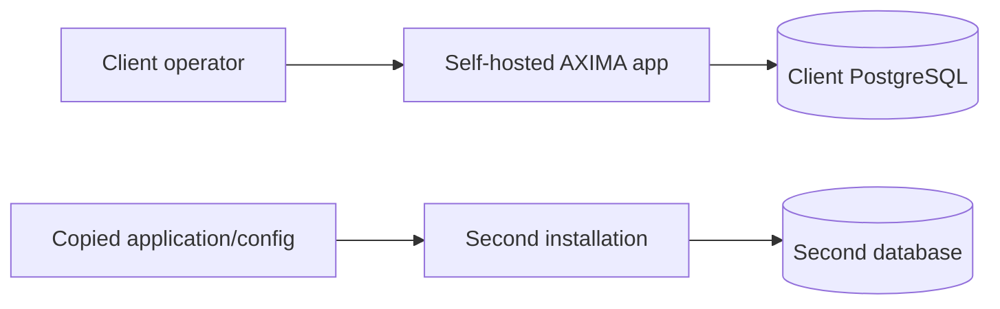

# Security Hardening Proposal: Trusted Self-Hosted Bootstrap

## Decision

Choose how AXIMA provisions a self-hosted store, protects setup secrets and proves which modules one installation may run without making licensing availability part of storefront availability.

## Executive Recommendation

We considered three choices: **Option 1, Offline signed file**; **Option 2, Hybrid activation and local grant**; and **Option 3, Short-lived online lease**. The selected design is Option 2. The installer generates an installation keypair, the AXIMA licensing server issues a publisher-signed grant bound to that public key, and the application verifies the grant locally. Option 1 remains an offline transport for exceptional networks. Option 3 is rejected because recurring renewal would make our control plane a customer runtime dependency.

## Evidence

I inspected the current design and source. The project has useful store and ERP seams but no installer, installation identity or entitlement verifier.

| Evidence | Finding or document | What it establishes |
| --- | --- | --- |
| `E001` | Practical platform foundation | Self-hosted deployments use one codebase, client profiles and idempotent bootstrap. |
| `E002` | Earlier AXIMA architecture | Signed artifacts, perpetual grants, installation identity and offline recovery were already desired. |
| `E003` | ERP extension contracts | Provider details are isolated, so licensing must stay outside ERP payloads. |
| `E004` | Store-scoped schema | Business data is scoped by store; installation and entitlements are not modeled. |
| `E005` | Runtime scripts | No install or license-verification command currently exists. |

Observed: setup and licensing have no code owner today. Inferred: adding checks independently to CLI, navigation and module handlers would cause policy drift. Proposed: one install orchestrator owns bootstrap, and one server-side capability resolver owns `installed ∩ licensed ∩ enabled`.

## Current Design And Failure Mode

Today the application can be copied wherever its configuration and database are available. That is acceptable for development, but a commercial self-hosted release needs a distinction between software bytes, installation identity and the right to use modules.

The relevant actor is a legitimate server operator with filesystem access. We cannot prevent that operator from patching JavaScript or cloning every persistent volume. We can remove the easy path where copying an image and ordinary configuration silently creates a second licensed deployment. Installer secrets are part of the same boundary: SMTP, ERP, database and installation private keys must not appear in image layers, public profiles, command history or license-server storage.

## Desired Invariants

- Every production deployment has a random locally generated installation keypair.
- The installation private key never leaves client-controlled secret storage.
- Only AXIMA publisher keys can issue a grant accepted by the application.
- A grant names the customer, public-key thumbprint, deployment class, modules and release entitlement.
- Effective modules equal installed, licensed and locally enabled modules intersected together.
- Capability checks are enforced server-side, not only by hidden navigation.
- A valid activated store starts and trades without contacting AXIMA.
- Copying application files and normal configuration without the installation private key requires activation.
- Install is idempotent and never rotates identity or overwrites data implicitly.
- Setup secrets are redacted and never accepted through unsafe command-line flags.

## Constraints And Non-Goals

We preserve a modular monolith and one isolated database per client. The AXIMA-owned licensing service is deployed separately and stores activation records, never customer commerce data or installation private keys.

We do not add hardware fingerprinting, TPM requirements, code obfuscation, destructive remote revocation, continuous heartbeat or shutdown on licensing outage. We explicitly accept that a root-controlled full-volume clone can still run.

## Before Architecture

The [before diagram](../diagrams/trusted-self-hosted-bootstrap-before.mmd) shows that original and copied deployments currently have equal authority.

## Options

### Option 1: Offline Signed License File

AXIMA issues a signed file which the installer stores locally. This gives the best offline behavior and the least infrastructure. Signature verification prevents editing module claims, but a license not bound to a local key can be copied with the app. Manual public-key exchange can improve the design and remains useful as an offline delivery path for Option 2.

Runtime CPU and memory costs are negligible because verification is local. Operations remain manual: issuance, transfer and recovery must be tracked by staff. Rollback restores the previous release and valid grant.

[Option 1 diagram](../diagrams/trusted-self-hosted-bootstrap-offline-file-after.mmd)

| Change | Before | After | Security consequence | Cost |
| --- | --- | --- | --- | --- |
| Issuance | None | Signed file | Blocks unsigned entitlement edits | Manual issuer process |
| Binding | None | Optional identifier | Weak copy deterrence | Minimal |
| Runtime | Independent | Independent | No licensing outage path | Slow revocation |
| Secrets | Ad hoc | Installer-owned files | Less accidental disclosure | Installer work |

### Option 2: Hybrid Activation And Local Grant

The installer generates an Ed25519 keypair locally and sends only its public key, activation key, release and requested modules to AXIMA over TLS. The server consumes an activation slot and returns a publisher-signed grant bound to the public-key thumbprint. The application verifies the publisher signature and confirms its local private key corresponds to that thumbprint.

This stops ordinary copies that omit protected identity state. A complete clone remains possible, which matches our stated non-goal. Optional status calls may help detect duplicates and support transfers, but they do not turn a perpetual grant into a lease. Revocation affects future activations and updates; it does not silently disable an already valid perpetual runtime.

Activation is outside the commerce path, while signature checks are local and cached after startup. The significant cost is operational rather than computational: AXIMA must secure signing keys, activation records and audit logs. Publisher license keys and release-signing keys must be separate.

Rollout can begin with assisted activation and a small API. Offline customers exchange a signed request/response using the same contract. Rollback retains the previous valid grant and installation identity; the installer never deletes either automatically.

[Option 2 diagram](../diagrams/trusted-self-hosted-bootstrap-hybrid-activation-after.mmd)

| Change | Before | After | Security consequence | Cost |
| --- | --- | --- | --- | --- |
| Identity | None | Local keypair | Partial copies cannot prove identity | Backup/recovery procedure |
| Issuance | None | Activation API | Enforces activation and module limits | AXIMA service |
| Verification | None | Local signed grant | No continuous network trust | Shared capability registry |
| Availability | Independent | Independent after activation | Licensing outage does not stop store | New installs need online/offline issuance |
| Transfer | Undefined | Audited deactivate/reactivate | Discourages reuse across buyers | Support workflow |

### Option 3: Short-Lived Online Lease

The application renews a short-lived signed lease. This offers faster revocation and stronger detection of concurrent clones. It is attractive for a subscription service where central enforcement is an explicit customer contract.

For AXIMA Self-Hosted, DNS, TLS, proxy, clock or licensing-service failures would consume a grace period and eventually affect local functionality. A long grace period weakens the protection; a short one makes AXIMA part of checkout availability. Memory and CPU remain small, but retry state, degraded-mode UX and high-availability operations are material.

Rollback requires issuing replacement perpetual grants before leases expire. This option is rejected under current reliability goals.

[Option 3 diagram](../diagrams/trusted-self-hosted-bootstrap-online-lease-after.mmd)

| Change | Before | After | Security consequence | Cost |
| --- | --- | --- | --- | --- |
| Entitlement | No check | Short lease | Faster revocation | Runtime network dependency |
| Failure mode | Local | Grace-period state machine | More central control | False lockout risk |
| Operations | No service | Highly available control plane | Better fleet visibility | Monitoring and on-call |

## Comparison

These effects are source-derived or hypothetical, not measured.

| Dimension | Option 1 | Option 2 | Option 3 |
| --- | --- | --- | --- |
| Security | Signed but weakly bound | Proportional copy deterrence | Strongest revocation |
| Performance | Local verification | Local after activation | Recurring network work |
| Memory | One grant | Key and grant cache | Lease/retry state |
| Reliability | Fully offline | Existing installs offline | Control-plane outage risk |
| Operability | Manual issuance | Moderate service burden | Highest service burden |
| Migration | Simplest | Moderate ordered slices | Lease/degraded-state migration |

Reliability and support policy drive this choice more than CPU or memory. We will still measure cold-start verification and activation latency before production acceptance.

## Recommendation

Option 2 is selected with perpetual local runtime grants and no mandatory heartbeat. Option 1 is retained only as an offline transport bound to the same installation public key. Option 3 should be reconsidered only if future commercial terms explicitly require subscription revocation and fund an available licensing control plane.

## Evidence Coverage And Residual Risk

| Evidence | Effect | Residual risk or work |
| --- | --- | --- |
| E001 — Platform foundation | Addresses trusted bootstrap | StoreProfile/bootstrap still require implementation |
| E002 — Self-hosted architecture | Makes signed grants concrete | Artifact signing remains separate work |
| E003 — ERP contracts | Preserves provider independence | Installer must validate ERP bindings safely |
| E004 — Store schema | Adds external installation identity | Full identity-volume clone remains possible |
| E005 — Runtime scripts | Adds install/license entrypoints | No enforcement exists before this rollout completes |

Publisher-key compromise, leaked activation keys, source patching and missed server-side module guards remain important risks. Key rotation, high-entropy one-time activation keys, audit logs and API-boundary tests are still required.

## Migration And Rollout

We first add versioned grant contracts and a local verifier without enforcing modules. Next we add installer plan/apply/resume, secret storage and idempotent bootstrap. Then we connect activation and introduce server-side capability enforcement module by module. Development mode must be explicit and production builds must reject development grants.

The first Westside installation is assisted. We retain an offline activation response and recovery copy of installation identity. If the activation service fails, already activated deployments continue with their last valid grant.

## Validation Plan

- Reject modified, unknown-version and wrong-installation grants.
- Restart and complete checkout with AXIMA network access blocked.
- Prove that a partial copy requires activation and document the accepted full-clone limitation.
- Redact activation, SMTP, ERP and database secrets from output and logs.
- Test interrupted install, rerun, migration failure and bootstrap retry.
- Exercise module enforcement at APIs/server actions, not only navigation.
- Rehearse activation transfer and publisher-key rotation.
- Measure verification time, activation latency and installer duration.

## Implementation Work Packages

The selected design is implemented in ordered slices: shared canonical grant contract; publisher and installation key handling; local verifier and capability resolver; resumable install CLI; secure config/secret persistence; activation service; idempotent store bootstrap; server-side module enforcement; recovery and transfer tools.

The installer collects store identity, URL, timezone/currency, initial administrator, database binding, SMTP settings and test recipient, enabled modules, ERP binding, media storage and activation input. Interactive and config-file modes share one validation path. Passwords use hidden prompts, environment references or secret files, never ordinary CLI flags.

## Open Questions

Implementation proceeds with current defaults: one production activation, perpetual runtime rights, no staging seat, no mandatory heartbeat and Docker Compose as the intended first server target. Staging entitlement, update cutoff, transfer overlap and first-release offline activation remain configurable policy decisions to confirm before production issuance.

